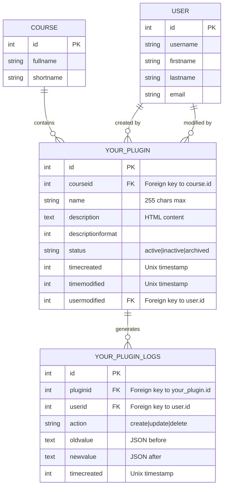

# Database Schema Documentation - Your Plugin

## Overview

Your Plugin database schema com tabelas principais para gerenciar items em cursos:
- `your_plugin`: Tabela principal de items
- `your_plugin_logs`: Auditoria de mudanças e histórico
- Relacionamentos com tabelas Moodle core (`course`, `user`)

## Tables Summary

| Table | Purpose | Record Growth | Retention |
|-------|---------|---|---|
| `your_plugin` | Store course items | Per course instance | Delete with course |
| `your_plugin_logs` | Audit trail | Per action | 1 year then archive |

## Entity Relationship Diagram

## Table Details

### your_plugin
- **Purpose**: Store main course items/activities
- **Indexed on**: 
  - `courseid` (frequently queried by course)
  - `status` (filter by active/inactive)
  - `timecreated` (sort by creation date)
- **Foreign Keys**: 
  - `courseid` → `course(id)` 
  - `usermodified` → `user(id)`
- **Deletion Policy**: Soft delete via `status='archived'` or cascade delete when course deleted
- **Size Estimate**: ~100KB per 1000 items

### your_plugin_logs
- **Purpose**: Audit trail for compliance and debugging
- **Indexed on**: 
  - `pluginid` (find changes for specific item)
  - `userid` (track user actions)
  - `timecreated` (time-based queries)
  - Composite: `(userid, timecreated)` for user activity timeline
- **Retention**: Keep 1 year, then archive to separate table
- **Size Estimate**: ~10MB per year (assumes 10 requests/minute average)
- **Cleanup Task**: Run nightly to archive old records

## Field Definitions

### your_plugin

| Field | Type | Nullable | Default | Purpose | Notes |
|-------|------|----------|---------|---------|-------|
| id | INT(10) | NO | auto-increment | Primary key | Auto-incremented |
| courseid | INT(10) | NO | - | Course this item belongs to | FK to course.id |
| name | VARCHAR(255) | NO | - | Item name | Unique per course? TBD |
| description | TEXT | YES | NULL | Rich HTML description | Use moodle_text_cleaning |
| descriptionformat | INT(2) | NO | 0 | Moodle format code | 0=plain, 1=HTML, 4=Markdown |
| status | VARCHAR(50) | NO | 'active' | active\|inactive\|archived | Use for soft deletes |
| timecreated | INT(10) | NO | - | Creation Unix timestamp | Set on insert only |
| timemodified | INT(10) | NO | - | Last modification timestamp | Update on every change |
| usermodified | INT(10) | NO | - | User who last modified | FK to user.id |

### your_plugin_logs

| Field | Type | Nullable | Purpose | Notes |
|-------|------|----------|---------|-------|
| id | INT(10) | NO | Primary key | Auto-incremented |
| pluginid | INT(10) | NO | References your_plugin.id | FK to your_plugin.id |
| userid | INT(10) | NO | References user.id | FK to user.id (who made change) |
| action | VARCHAR(50) | NO | Action type | 'create', 'update', 'delete' |
| oldvalue | TEXT | YES | JSON snapshot before change | NULL for 'create' action |
| newvalue | TEXT | YES | JSON snapshot after change | NULL for 'delete' action |
| timecreated | INT(10) | NO | Timestamp of change | Unix timestamp |

## Migration History

| Version | Date | Change | Revision |
|---------|------|--------|----------|
| 1.0.0 | 2026-01-01 | Initial schema | [db/install.php](../db/install.php) |
| 1.0.5 | 2026-02-15 | Added 'usermodified' field for tracking | [db/upgrade.php](../db/upgrade.php) L45-52 |
| 1.1.0 | 2026-03-04 | Refactored status field, added logging table | [db/upgrade.php](../db/upgrade.php) L100-150 |

## Performance Notes

### Query Optimization
- **SELECT by course**: Use `courseid` index (~10ms on 100k items)
- **SELECT by status**: Use `status` index for filtering
- **SELECT with ORDER**: Compound index on `(courseid, timecreated)` recommended for future

### Size Estimates
- **your_plugin table**: ~500 bytes per record
  - 1000 items = ~500KB
  - 100,000 items = ~50MB
- **your_plugin_logs table**: ~1KB per log entry (with JSON blobs)
  - 1000 entries/day = ~365MB/year
  - Archive at 1 year threshold

### Slow Query Monitoring
- All queries should execute in < 100ms
- Enable `log_queries` in development to identify N+1 patterns
- See [Performance Guide](performance.md) for profiling

## Installation & Upgrades

### Fresh Installation
- Run `db/install.php` to create both `your_plugin` and `your_plugin_logs` tables
- No data migration needed for new installs

### Upgrading from 1.0.0 → 1.1.0
- Run `db/upgrade.php` 
- Adds `usermodified` field with default user ID 2 (Admin)
- Creates `your_plugin_logs` table
- No data loss

### Downgrade (Not Supported)
- Database schema is forward-only
- Downgrading requires full database restore

## Related Documentation

- [GitHub: db/install.php](../db/install.php)
- [GitHub: db/upgrade.php](../db/upgrade.php)
- [Performance Guide](performance.md)
- [API Reference](../amd/README.md)
- [Contributing Guide](../CONTRIBUTING.md)

## Maintenance Tasks

### Weekly
- Monitor log table size
- Check for orphaned records

### Monthly
- Analyze index fragmentation (MySQL: `ANALYZE TABLE`)
- Review slow query logs

### Yearly
- Archive old logs (logs > 1 year)
- Recalculate statistics

## Last Updated
- **Date**: 2026-03-04
- **By**: KelsonCM
- **For Version**: 1.1.0
