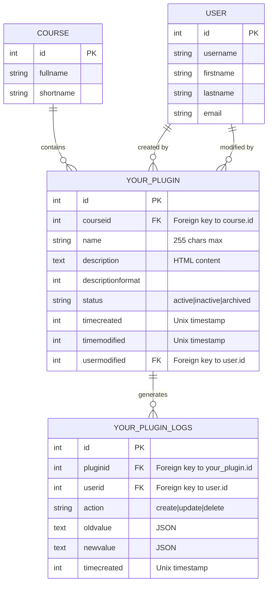

# Guia de boas práticas para desenvolvimento de plugins Moodle

Este documento consolida as melhores práticas para desenvolvimento de plugins Moodle profissionais, baseado na análise de projetos reais bem-sucedidos, especialmente o **tiny_justify** como caso de estudo. O objetivo é fornecer um roteiro completo para criar plugins de alta qualidade, manuteníveis e seguros desde o início do projeto.

---

# Índice
- [Guia de boas práticas para desenvolvimento de plugins Moodle](#guia-de-boas-práticas-para-desenvolvimento-de-plugins-moodle)
- [Índice](#índice)
- [1. Visão Geral](#1-visão-geral)
  - [1.1. Princípios Fundamentais](#11-princípios-fundamentais)
  - [1.2. Por Que Isso Importa?](#12-por-que-isso-importa)
  - [1.3. Fundação inicial](#13-fundação-inicial)
- [2. Documentação](#2-documentação)
  - [2.1. `CHANGELOG.md`](#21-changelogmd)
  - [2.2. `CONTRIBUTING.md`](#22-contributingmd)
  - [2.3. `README.md`](#23-readmemd)
  - [2.4. `SECURITY.md`](#24-securitymd)
      - [Exemplo Mínimo de SECURITY.md](#exemplo-mínimo-de-securitymd)
- [3. CI/CD](#3-cicd)
  - [3.1. `.github/dependabot.yml`](#31-githubdependabotyml)
    - [3.1.1 Configuração Básica:](#311-configuração-básica)
    - [3.1.2 Configuração Avançada\*\*:](#312-configuração-avançada)
  - [3.2. `.github/workflows/moodle-plugin-ci.yml`](#32-githubworkflowsmoodle-plugin-ciyml)
    - [3.2.1 Exemplo de matrix de testes](#321-exemplo-de-matrix-de-testes)
    - [3.2.2. Exemplo completo](#322-exemplo-completo)
  - [3.3. `.github/workflows/release.yml`](#33-githubworkflowsreleaseyml)
    - [3.3.1 Workflow Completo](#331-workflow-completo)
    - [3.3.2 Workflow de Release](#332-workflow-de-release)
- [4. Testes](#4-testes)
  - [4.1. Testes Behat (Integração/E2E) ⭐ Essencial](#41-testes-behat-integraçãoe2e--essencial)
  - [4.2. Testes PHPUnit (Unidade/Componente) 🔧 Recomendado](#42-testes-phpunit-unidadecomponente--recomendado)
    - [4.2.1. Estrutura de Diretório:](#421-estrutura-de-diretório)
    - [4.2.2. Template Test Class:](#422-template-test-class)
    - [4.2.3. Running PHPUnit Locally:](#423-running-phpunit-locally)
  - [4.3. Testes JavaScript/AMD 🧪 Opcional](#43-testes-javascriptamd--opcional)
    - [4.3.1. Estrutura:](#431-estrutura)
    - [4.3.2. Template Test:](#432-template-test)
    - [4.3.3. Exemplo Real (tiny\_justify):](#433-exemplo-real-tiny_justify)
  - [4.4. Cobertura de Testes e Requisitos de CI](#44-cobertura-de-testes-e-requisitos-de-ci)
    - [4.4.1. Metas de Cobertura de Testes](#441-metas-de-cobertura-de-testes)
    - [4.4.2. Pipeline de CI no GitHub Actions](#442-pipeline-de-ci-no-github-actions)
    - [4.4.3. Regras de Proteção de Branch](#443-regras-de-proteção-de-branch)
    - [4.4.4. Testes Locais Antes do Push](#444-testes-locais-antes-do-push)
    - [4.4.5. Checklist de CI/CD](#445-checklist-de-cicd)
- [4.5. Mobile-first e Suporte ao App](#45-mobile-first-e-suporte-ao-app)
  - [4.5.1. Design Responsivo](#451-design-responsivo)
  - [4.5.2. Interface Touch-Friendly](#452-interface-touch-friendly)
  - [4.5.3. Integração com o Moodle Mobile App](#453-integração-com-o-moodle-mobile-app)
  - [4.5.4. Web Services para Mobile](#454-web-services-para-mobile)
  - [4.5.5. Testes em Mobile](#455-testes-em-mobile)
- [5. Versionamento e Releases](#5-versionamento-e-releases)
  - [5.1. Sistema de Versionamento Duplo](#51-sistema-de-versionamento-duplo)
  - [5.2. Sincronização de Versões](#52-sincronização-de-versões)
  - [5.3. Tags Git e Releases](#53-tags-git-e-releases)
  - [5.4. Conventional Commits](#54-conventional-commits)
    - [5.4.1. Formato:](#541-formato)
    - [5.4.2. Tipos Comuns:](#542-tipos-comuns)
    - [5.4.3. Exemplos Reais (tiny\_justify):](#543-exemplos-reais-tiny_justify)
    - [5.4.4. Benefícios:](#544-benefícios)
  - [5.5. Fluxo Completo de Release](#55-fluxo-completo-de-release)
- [6. Git Workflow e Branching](#6-git-workflow-e-branching)
  - [6.1. Estratégia de Branching (Trunk-Based Development)](#61-estratégia-de-branching-trunk-based-development)
    - [Estrutura de Branches:](#estrutura-de-branches)
    - [Naming Convention:](#naming-convention)
  - [6.2. Regras de Proteção de Branch no GitHub](#62-regras-de-proteção-de-branch-no-github)
    - [Exemplo CODEOWNERS:](#exemplo-codeowners)
- [7. .gitignore Padrão para Plugins Moodle](#7-gitignore-padrão-para-plugins-moodle)
- [8. Code Review Best Practices](#8-code-review-best-practices)
  - [8.1. Para Autores de PR](#81-para-autores-de-pr)
  - [8.2. Para Reviewers](#82-para-reviewers)
- [9. Pre-Release Checklist](#9-pre-release-checklist)
  - [9.1. Antes de fazer uma release\*\*:](#91-antes-de-fazer-uma-release)
  - [9.2. Release Script Rápido](#92-release-script-rápido)
- [10. Referências](#10-referências)
- [11. Backup e Restauração](#11-backup-e-restauração)
  - [11.1. Matriz de Recomendações por Tipo de Plugin](#111-matriz-de-recomendações-por-tipo-de-plugin)
  - [11.2. Estrutura de Arquivos](#112-estrutura-de-arquivos)
  - [11.3. Arquivo `backup_plugintype_pluginname_activity.class.php`](#113-arquivo-backup_plugintype_pluginname_activityclassphp)
  - [11.4. Arquivo `restore_plugintype_pluginname_activity.class.php`](#114-arquivo-restore_plugintype_pluginname_activityclassphp)
- [12. Serviço Externo (API Web Service)](#12-serviço-externo-api-web-service)
  - [12.1. Estrutura de Arquivos](#121-estrutura-de-arquivos)
  - [12.2. Arquivo `db/services.php`](#122-arquivo-dbservicesphp)
  - [12.3. Arquivo `classes/external/api.php`](#123-arquivo-classesexternalapiphp)
  - [12.4. Ativar o Web Service](#124-ativar-o-web-service)
  - [12.5. Chamar Web Service (Exemplo REST)](#125-chamar-web-service-exemplo-rest)
- [13. Tasks (Cron Jobs)](#13-tasks-cron-jobs)
  - [13.1. Arquivo `db/tasks.php`](#131-arquivo-dbtasksphp)
  - [13.2. Scheduled Task Class](#132-scheduled-task-class)
  - [13.3. Ad Hoc Task Class](#133-ad-hoc-task-class)
  - [13.4. Executar Ad Hoc Task Programaticamente](#134-executar-ad-hoc-task-programaticamente)
  - [13.5. Cleanup Task (Exemplo Prático)](#135-cleanup-task-exemplo-prático)
- [14. Capabilities (Permissões)](#14-capabilities-permissões)
  - [14.1. Arquivo `db/access.php`](#141-arquivo-dbaccessphp)
  - [14.2. Usando Capabilities no Código](#142-usando-capabilities-no-código)
  - [14.3. Convenção de Nomes para Capabilities](#143-convenção-de-nomes-para-capabilities)
  - [14.4. Níveis de Contexto](#144-níveis-de-contexto)
  - [14.5. Captype (Tipo de Permissão)](#145-captype-tipo-de-permissão)
- [15. Segurança by Design](#15-segurança-by-design)
  - [15.1. Validação de Entrada e Sanitização](#151-validação-de-entrada-e-sanitização)
    - [Validação de Entrada](#validação-de-entrada)
    - [Parâmetros Moodle (PARAM\_\*)](#parâmetros-moodle-param_)
  - [15.2. Prevenção de SQL Injection](#152-prevenção-de-sql-injection)
    - [❌ SQL Injection Vulnerável](#-sql-injection-vulnerável)
    - [✅ Prepared Statements (Query Binding)](#-prepared-statements-query-binding)
    - [Tabelas com Prefixo](#tabelas-com-prefixo)
  - [15.3. Prevenção de XSS (Cross-Site Scripting)](#153-prevenção-de-xss-cross-site-scripting)
    - [❌ XSS Vulnerável](#-xss-vulnerável)
    - [✅ XSS Prevention com Escaping](#-xss-prevention-com-escaping)
    - [Escapar em JavaScript](#escapar-em-javascript)
  - [15.4. Proteção contra CSRF (Cross-Site Request Forgery)](#154-proteção-contra-csrf-cross-site-request-forgery)
    - [✅ CSRF Prevention com Sessions Tokens](#-csrf-prevention-com-sessions-tokens)
  - [15.5. Context e Role-Based Access Control](#155-context-e-role-based-access-control)
    - [Validação de Contexto](#validação-de-contexto)
    - [Context Hierarchy](#context-hierarchy)
  - [15.6. Secure Cookies](#156-secure-cookies)
  - [15.7. Data Encryption e Secrets Management](#157-data-encryption-e-secrets-management)
    - [Dados Sensíveis no Database](#dados-sensíveis-no-database)
    - [Secrets em Variáveis de Ambiente](#secrets-em-variáveis-de-ambiente)
  - [15.8. Logs de Auditoria](#158-logs-de-auditoria)
    - [Registro Manual (para dados sensíveis extras)](#registro-manual-para-dados-sensíveis-extras)
  - [15.9. Checklist de Segurança](#159-checklist-de-segurança)
    - [Antes de Fazer Commit](#antes-de-fazer-commit)
    - [Antes de Release](#antes-de-release)
    - [Em Produção](#em-produção)
- [16. Design de Banco de Dados](#16-design-de-banco-de-dados)
  - [16.1. Planejamento de Schema](#161-planejamento-de-schema)
  - [16.2. Estratégia de Migração](#162-estratégia-de-migração)
  - [16.3. Índices e Performance](#163-índices-e-performance)
  - [16.4. Chaves Estrangeiras e Restrições](#164-chaves-estrangeiras-e-restrições)
  - [16.5. Documentação de Banco com Mermaid](#165-documentação-de-banco-com-mermaid)
- [17. Estratégia de Cache](#17-estratégia-de-cache)
  - [17.1. Tipos de Cache no Moodle](#171-tipos-de-cache-no-moodle)
  - [17.2. MUC (Moodle Universal Cache)](#172-muc-moodle-universal-cache)
  - [17.3. Invalidação de Cache](#173-invalidação-de-cache)
  - [17.4. Considerações de Performance](#174-considerações-de-performance)
- [18. Performance e Perfilamento](#18-performance-e-perfilamento)
  - [18.1. Perfilamento de Queries](#181-perfilamento-de-queries)
  - [18.2. Armadilhas Comuns (N+1, etc)](#182-armadilhas-comuns-n1-etc)
  - [18.3. Benchmarking](#183-benchmarking)
  - [18.4. Checklist de Otimização](#184-checklist-de-otimização)
- [19. Tratamento de Erros e Exceções](#19-tratamento-de-erros-e-exceções)
  - [19.1. Hierarquia de Exceções](#191-hierarquia-de-exceções)
  - [19.2. Mensagens de Erro Amigáveis](#192-mensagens-de-erro-amigáveis)
  - [19.3. Log de Erros](#193-log-de-erros)
- [20. Acessibilidade (A11y)](#20-acessibilidade-a11y)
  - [20.1. Conformidade WCAG](#201-conformidade-wcag)
  - [20.2. Navegação por Teclado](#202-navegação-por-teclado)
  - [20.3. ARIA Labels](#203-aria-labels)
  - [20.4. Testes de Acessibilidade](#204-testes-de-acessibilidade)
- [21. Internacionalização (i18n)](#21-internacionalização-i18n)
  - [21.1. Strings de Idioma](#211-strings-de-idioma)
  - [21.2. Formatação e Contexto de Strings](#212-formatação-e-contexto-de-strings)
  - [21.3. Fluxo de Tradução](#213-fluxo-de-tradução)
  - [21.4. Formas de Plural](#214-formas-de-plural)
- [22. Logs e Depuração](#22-logs-e-depuração)
  - [22.1. Configuração de Servidor de Depuração](#221-configuração-de-servidor-de-depuração)
  - [22.2. Padrões de Log de Erro](#222-padrões-de-log-de-erro)
  - [22.3. Depuração em Produção](#223-depuração-em-produção)
  - [22.4. Estratégia de Armazenamento de Logs](#224-estratégia-de-armazenamento-de-logs)
  - [22.5. Eventos Moodle (emissão e consumo)](#225-eventos-moodle-emissão-e-consumo)
- [23. Deploy em Produção e Monitoramento](#23-deploy-em-produção-e-monitoramento)
  - [23.1. Verificações Pré-Deploy](#231-verificações-pré-deploy)
  - [23.2. Estratégia de Deploy (Blue-Green)](#232-estratégia-de-deploy-blue-green)
  - [23.3. Verificações e Monitoramento](#233-verificações-e-monitoramento)
  - [23.4. Rastreamento de Erros (Sentry)](#234-rastreamento-de-erros-sentry)
  - [23.5. Monitoramento de Performance](#235-monitoramento-de-performance)
  - [23.6. Procedimento de Rollback](#236-procedimento-de-rollback)
- [24. Migração de Sistemas Legados](#24-migração-de-sistemas-legados)
  - [24.1. Estratégia de Migração de Dados](#241-estratégia-de-migração-de-dados)
  - [24.2. Caminhos de Upgrade](#242-caminhos-de-upgrade)
  - [24.3. Validação de Dados](#243-validação-de-dados)
  - [24.4. Rollback e Recuperação](#244-rollback-e-recuperação)
- [25. Versão e Finalização](#25-versão-e-finalização)
  - [25.1. Checklist de Rastreabilidade](#251-checklist-de-rastreabilidade)
  - [25.2. Iteração Contínua](#252-iteração-contínua)

# 1. Visão Geral

## 1.1. Princípios Fundamentais

Um plugin Moodle moderno e profissional deve seguir estes princípios desde o primeiro commit:

1. ✅ **Infraestrutura primeiro, código depois** - CI/CD não é opcional
2. ✅ **Testes múltiplos níveis** - Unit, integration, e2e
3. ✅ **Documentação viva** - `CHANGELOG.md`, `CONTRIBUTING.md`, `README.md`, `SECURITY.md` e `LICENSE.md`
4. ✅ **Automação de releases** - Zero erros humanos
5. ✅ **Versionamento consistente** - Semântico + timestamp
6. ✅ **Segurança by design** - Capabilities, sanitization, prepared statements
7. ✅ **Commits descritivos** - Conventional Commits  

## 1.2. Por Que Isso Importa?

| Aspecto              | Sem Boas Práticas                  | Com Boas Práticas        |
| -------------------- | ---------------------------------- | ------------------------ |
| **Confiabilidade**   | Bugs em produção                   | Detectados em CI         |
| **Manutenibilidade** | Código legado em 6 meses           | Código vivo após anos    |
| **Onboarding**       | Dias explorando código             | Horas lendo docs         |
| **Releases**         | Processo manual, propensa a erros  | Automático, consistente  |
| **Compatibilidade**  | Quebra em novas versões Moodle     | Testado contra matrix    |
| **Segurança**        | Vulnerabilidades descobertas tarde | Preventiva e documentada |


## 1.3. Fundação inicial

**Instrução crítica**: Criar infraestrutura de CI/CD **no primeiro commit**, não depois.

| Categoria | Arquivos                                       |
| --------- | ---------------------------------------------- |
| CI/CD     | `.github/workflows/`, `.github/dependabot.yml` |
| Código    | `classes/`, `amd/src/`                         |
| Testes    | `tests/behat/`, `tests/javascript/`            |
| Database  | `db/install.php`, `db/upgrade.php`             |
| Lang      | `lang/en/`, `lang/pt_br/`                      |
| Config    | `version.php`, `styles.css`, `pix/`            |

# 2. Documentação

**Instrução crítica**: A documentação é crítica e deve ser criada no **primeiro commit**, não como afterthought, e atualizadas a cada iteração, sendo o mínimo:
1. ✅ `CHANGELOG.md`
2. ✅ `CONTRIBUTING.md`
3. ✅ `README.md`
4. ✅ `SECURITY.md`
5. ✅ `LICENSE.md` - Necessariamente em GPLv3

## 2.1. `CHANGELOG.md`

**O que é**: Histórico estruturado de todas as mudanças por versão.

**Por que é crítico**:
- Rastreabilidade de mudanças ao longo do tempo
- Ajuda usuários a entender impacto de atualizações
- Facilita depuração ("quando esse comportamento mudou?")
- Padrão internacional ([Keep a Changelog](https://keepachangelog.com/))

**Template Inicial**:
```markdown
# Changelog

All notable changes to this project will be documented in this file.

The format is based on [Keep a Changelog](https://keepachangelog.com/en/1.0.0/).

# [Unreleased]

### Added
- Feature A in progress
- Feature B planned

## [1.0.0] - 2026-03-04

### Added
- Initial release
- Main functionality X
- Support for Moodle 4.5-5.1

### Fixed
- Bug in edge case Y

### Security
- Input sanitization implemented
```

**Seções Padrão**: `Added`, `Changed`, `Deprecated`, `Removed`, `Fixed`, `Security`

**Exemplo Real (tiny_justify)**:
```markdown
## [1.0.21] - 2026-03-03
### Fixed
- Align plugin with Moodle contribution checklist
- Update PostgreSQL to version 15
- Add support for PHP 8.4 and Moodle 5.1
```

## 2.2. `CONTRIBUTING.md`

**O que é**: Guia completo para contribuidores externos e futuros mantenedores.

**Seções Obrigatórias**:

1. Overview
2. How to Contribute
3. Reporting Bugs
4. Suggesting Features
5. Code Style
6. Development Workflow (crítico!)
7. Troubleshooting
8. License

> Code style example:
>    1. Links:
>       1. [Moodle Coding style](https://moodledev.io/general/development/policies/codingstyle)
>       2. [Moodle Accessibility Guide](https://moodledev.io/general/development/policies/accessibility)
>    1. Tools:
>       1. PHP Lint: `phplint`
>       2. PHP Copy/Paste Detector: `phpcpd`
>       3. PHP Mess Detector: `phpmd`
>       4. Moodle Code Checker: `codechecker`
>       5. Moodle PHPDoc Checker: `phpdoc`
>       6. Validating: `validate`
>       7. Check upgrade savepoints: `savepoints`
>       8. Mustache Lint: `mustache`

## 2.3. `README.md`

1. Overview
2. Requirements
3. Installation
4. Configuration
5. Usage
6. License
7. Contributing
8. Support

## 2.4. `SECURITY.md`

**O que é**: Documento de segurança que descreve práticas e vulnerabilidades do plugin.

**Quando é essencial**:
- ✅ Plugin manipula dados de usuário
- ✅ Plugin executa queries SQL
- ✅ Plugin lida com capabilities/permissões
- ✅ Plugin aceita uploads de arquivos
- ✅ Plugin processa dados externos

**Quando é opcional, ainda que recomendado**:
- ⚠️ Plugin puramente visual (botões de editor, temas simples)
- ⚠️ Plugin read-only sem lógica de negócio

**Seções Obrigatórias**:

1. **Supported Versions** - Quais versões do Moodle, PHP, database são suportadas
2. **Security Properties** - Quais capacidades, validações e controles estão implementados
3. **Security Considerations** - Análise de riscos e mitigações (SQL injection, XSS, CSRF)
4. **Security Best Practices for Developers** - Como contribuir com segurança em mente
5. **Security Best Practices for Administrators** - Como instalar, configurar e monitorar
6. **Dependencies** - Versões mínimas obrigatórias do Moodle, PHP, database
7. **Test Matrix** - Quais combinações são testadas
8. **Reporting a Vulnerability** - Como reportar sem criar issues públicas
9. **License** - GPLv3
10. **Contact & Support** - Onde encontrar help

#### Exemplo Mínimo de SECURITY.md

```markdown
# Security Policy

## Supported Versions

| Version | Support Status     | Until      |
| ------- | ------------------ | ---------- |
| 1.0.20+ | Actively Supported | 2027-03-04 |
| 1.0.0   | End of Life        | 2025-12-31 |

## Security Properties

- **Capabilities**: Uses `moodle/course:viewparticipants` for access control
- **Input Validation**: All user inputs validated using `required_param()` and `optional_param()`
- **Database Queries**: All DB queries use parameterized statements via `$DB->prepare()`

## Security Considerations

- **SQL Injection**: Mitigated through parameterized queries
- **XSS**: Mitigated through Moodle's output filtering
- **CSRF**: Mitigated through Moodle's CSRF tokens

## Reporting a Vulnerability

**DO NOT** create a GitHub issue for security vulnerabilities.

Email: security@example.com

Include:
- Description
- Steps to reproduce
- Potential impact
- Affected versions

We respond within 48 hours and patch critical issues within 7 days.
```

# 3. CI/CD

## 3.1. `.github/dependabot.yml`

**Por que é importante**: Mantém dependências seguras automaticamente.

### 3.1.1 Configuração Básica:
```yaml
version: 2
updates:
  - package-ecosystem: "composer"
    directory: "/"
    schedule:
      interval: "weekly"
    open-pull-requests-limit: 5
```

### 3.1.2 Configuração Avançada**:
```yaml
version: 2
updates:
  - package-ecosystem: "composer"
    directory: "/"
    schedule:
      interval: "weekly"
      day: "monday"
      time: "09:00"
    labels:
      - "dependencies"
      - "composer"
    reviewers:
      - "maintainer-username"
    commit-message:
      prefix: "chore"
      include: "scope"
```


## 3.2. `.github/workflows/moodle-plugin-ci.yml`

**Objetivo**: Testar plugin contra múltiplas versões de Moodle, PHP e databases automaticamente.

### 3.2.1 Exemplo de matrix de testes

| PHP | Moodle 4.5 | Moodle 5.0 | Moodle 5.1 | Databases      |
| --- | ---------- | ---------- | ---------- | -------------- |
| 8.1 | ✅          | ❌          | ❌          | pgsql, mariadb |
| 8.2 | ✅          | ✅          | ✅          | pgsql, mariadb |
| 8.3 | ✅          | ✅          | ✅          | pgsql, mariadb |
| 8.4 | ❌          | ✅          | ✅          | pgsql, mariadb |

**Resultado**: ~20 combinações testadas automaticamente em cada push! Tempo total ~5min, se fosse linear seria ~120min.

### 3.2.2. Exemplo completo

```yaml
name: Moodle Plugin CI

on:
  push:
    branches: [main, MOODLE_*]
  pull_request:
    branches: [main, MOODLE_*]

permissions:
  contents: read

jobs:
  test:
    name: Moodle ${{ matrix.moodle-branch }} / PHP ${{ matrix.php }} / DB ${{ matrix.database }}
    runs-on: ubuntu-latest

    services:
      postgres:
        image: postgres:15
        env:
          POSTGRES_USER: postgres
          POSTGRES_HOST_AUTH_METHOD: trust
        ports:
          - 5432:5432
        options: >-
          --health-cmd pg_isready
          --health-interval 10s
          --health-timeout 5s
          --health-retries 5

    strategy:
      fail-fast: true
      matrix:
        php: ['8.1', '8.2', '8.3', '8.4']
        moodle-branch: ['MOODLE_405_STABLE', 'MOODLE_500_STABLE', 'MOODLE_501_STABLE']
        database: [pgsql, mariadb]
        include:
          - database: mariadb
            service: mariadb
        exclude:
          # PHP 8.4 não suportado em Moodle 4.5
          - moodle-branch: 'MOODLE_405_STABLE'
            php: '8.4'
          # PHP 8.1 não suportado em Moodle 5.0+
          - moodle-branch: 'MOODLE_500_STABLE'
            php: '8.1'
          - moodle-branch: 'MOODLE_501_STABLE'
            php: '8.1'

    steps:
      - name: Check out repository code
        uses: actions/checkout@v4
        with:
          path: plugin

      - name: Setup PHP ${{ matrix.php }}
        uses: shivammathur/setup-php@v2
        with:
          php-version: ${{ matrix.php }}
          extensions: mbstring, pdo, pdo_pgsql, pgsql, mysqli, gd, intl, xml, zip, curl
          ini-values: max_input_vars=5000
          coverage: none

      - name: Start MariaDB service
        if: matrix.database == 'mariadb'
        run: |
          docker run -d \
            --name mariadb \
            -e MYSQL_ALLOW_EMPTY_PASSWORD=yes \
            -e MYSQL_CHARACTER_SET_SERVER=utf8mb4 \
            -e MYSQL_COLLATION_SERVER=utf8mb4_unicode_ci \
            -p 3306:3306 \
            mariadb:10.11
          sleep 10

      - name: Initialise moodle-plugin-ci
        run: |
          composer create-project -n --no-dev --prefer-dist \
            moodlehq/moodle-plugin-ci ci ^4
          echo "$(cd ci && pwd)/bin" >> $GITHUB_PATH
          echo "$(cd ci && pwd)/vendor/bin" >> $GITHUB_PATH
          sudo locale-gen en_AU.UTF-8

      - name: Install moodle-plugin-ci
        run: moodle-plugin-ci install --plugin ./plugin --db-host=127.0.0.1
        env:
          DB: ${{ matrix.database }}
          MOODLE_BRANCH: ${{ matrix.moodle-branch }}

      - name: PHP Lint
        if: ${{ !cancelled() }}
        run: moodle-plugin-ci phplint

      - name: PHP Mess Detector
        if: ${{ !cancelled() }}
        run: moodle-plugin-ci phpmd

      - name: Moodle Code Checker
        if: ${{ !cancelled() }}
        run: moodle-plugin-ci codechecker --max-warnings 0

      - name: Moodle PHPDoc Checker
        if: ${{ !cancelled() }}
        run: moodle-plugin-ci phpdoc --max-warnings 0

      - name: Validations
        if: ${{ !cancelled() }}
        run: moodle-plugin-ci validate

      - name: Check upgrade savepoints
        if: ${{ !cancelled() }}
        run: moodle-plugin-ci savepoints

      - name: Mustache Lint
        if: ${{ !cancelled() }}
        run: moodle-plugin-ci mustache

      - name: Grunt
        if: ${{ !cancelled() }}
        run: moodle-plugin-ci grunt --max-lint-warnings 0

      - name: PHPUnit tests
        if: ${{ !cancelled() }}
        run: moodle-plugin-ci phpunit --fail-on-warning

      - name: Behat features
        if: ${{ !cancelled() }}
        run: moodle-plugin-ci behat --profile chrome
```

## 3.3. `.github/workflows/release.yml`

**Objetivo**: Automatizar criação de releases, empacotamento ZIP, e upload para GitHub Releases e para Moodle Plugin Directory.

**Validações Implementadas**:
1. ✅ `$plugin->version` últimos 2 dígitos == `$plugin->release` últimos 2 dígitos
2. ✅ `$plugin->release` == git tag name
3. ✅ ZIP contém estrutura correta de diretório
4. ✅ Upload confirma sucesso antes de marcar release

### 3.3.1 Workflow Completo

```yaml
name: Release

on:
  push:
    tags:
      - '*'

jobs:
  release:
    name: Build and release plugin ZIP
    runs-on: ubuntu-latest
    permissions:
      contents: write

    steps:
      - name: Checkout repository
        uses: actions/checkout@v4

      - name: Extract and validate plugin version
        id: version
        run: |
          VERSION=$(grep -oP '\$plugin->version\s*=\s*\K[0-9]+' version.php)
          RELEASE=$(grep -oP "\\\$plugin->release\s*=\s*'\K[^']+" version.php)

          VERSION_SUFFIX="${VERSION: -2}"
          RELEASE_SUFFIX="${RELEASE##*.}"

          echo "Plugin version: $VERSION (suffix: $VERSION_SUFFIX)"
          echo "Plugin release: $RELEASE (suffix: $RELEASE_SUFFIX)"

          TAG="${GITHUB_REF_NAME#v}"

          echo "Tag (sem prefixo v): $TAG"

          # Validação 1: Últimos 2 dígitos devem corresponder
          if [ "$VERSION_SUFFIX" != "$RELEASE_SUFFIX" ]; then
            echo "::error::Version/release suffix mismatch"
            exit 1
          fi

          # Validação 2: Release deve corresponder à tag
          if [ "$RELEASE" != "$TAG" ]; then
            echo "::error::Release ($RELEASE) doesn't match tag ($TAG)"
            exit 1
          fi

          echo "number=$VERSION" >> "$GITHUB_OUTPUT"

      - name: Build plugin ZIP
        id: build
        env:
          PLUGIN_NAME: ${{ github.event.repository.name }}
        run: |
          mkdir -p /tmp/build/$PLUGIN_NAME

          rsync -a \
            --exclude='.git' \
            --exclude='.github' \
            --exclude='node_modules' \
            --exclude='.gitignore' \
            --exclude='tests' \
            --exclude='vendor' \
            . /tmp/build/$PLUGIN_NAME/

          cd /tmp/build
          zip -r "$GITHUB_WORKSPACE/$PLUGIN_NAME-${{ steps.version.outputs.number }}.zip" $PLUGIN_NAME/
          echo "zipfile=$PLUGIN_NAME-${{ steps.version.outputs.number }}.zip" >> "$GITHUB_OUTPUT"

      - name: Create GitHub Release
        uses: softprops/action-gh-release@v2
        with:
          files: ${{ steps.build.outputs.zipfile }}
          generate_release_notes: true

      - name: Upload to Moodle Plugin Directory
        if: ${{ secrets.MOODLE_DIRECTORY_TOKEN != '' }}
        env:
          MOODLE_DIRECTORY_TOKEN: ${{ secrets.MOODLE_DIRECTORY_TOKEN }}
          PLUGIN_NAME: ${{ github.event.repository.name }}
        run: |
          ZIPFILE="${PLUGIN_NAME}-${{ steps.version.outputs.number }}.zip"
          
          RESPONSE=$(curl -s -w "\n%{http_code}" \
            -F data=@"$GITHUB_WORKSPACE/$ZIPFILE" \
            "https://moodle.org/webservice/upload.php?token=$MOODLE_DIRECTORY_TOKEN")

          HTTP_CODE=$(echo "$RESPONSE" | tail -1)
          BODY=$(echo "$RESPONSE" | sed '$d')

          echo "HTTP status: $HTTP_CODE"
          echo "Response: $BODY"

          if [ "$HTTP_CODE" -ne 200 ] || echo "$BODY" | grep -q '"error"'; then
            echo "::error::Failed to upload to Moodle Plugin Directory"
            exit 1
          fi
          
          echo "✅ Successfully published to Moodle Plugin Directory"
```

### 3.3.2 Workflow de Release

**1. Update `version.php`**

```php
$plugin->version  = 2026030401;  # YYYYMMDDRR
$plugin->release  = '1.0.1';     # Semantic
```

**2. Update `CHANGELOG.md`**

Acrescente ao início do arquivo:

```markdown
## [1.0.1] - 2026-03-04
### Fixed
- Bug fix description ....

```

**3. Commit**

```bash
git add version.php CHANGELOG.md
git commit -m "chore: bump version to 1.0.1"
```

**4. Tag (trigger release workflow)**

```bash
git tag -a 1.0.1 -m "Release 1.0.1"
git push origin main --tags
```

**5. Automatic: CI tests run, ZIP created, release published**

> **Objetivo**: Zero erros humanos em releases!


# 4. Testes

## 4.1. Testes Behat (Integração/E2E) ⭐ Essencial

**O que são**: Testes de integração em linguagem natural (Gherkin) que validam fluxos completos de usuário.

**Estrutura de Diretório**:
```
tests/
└── behat/
    ├── your_plugin.feature
    └── behat_your_plugin.php (optional custom steps)
```

**Template Feature File**:
```gherkin
@your_plugin @javascript
Feature: Your Plugin Functionality
  In order to use feature X
  As a teacher
  I need to perform action Y

  Background:
    Given the following "users" exist:
      | username | firstname | lastname | email |
      | teacher1 | Teacher | One | teacher1@example.com |
      | student1 | Student | One | student1@example.com |
    And the following "courses" exist:
      | fullname | shortname | category |
      | Course 1 | C1 | 0 |
    And the following "course enrolments" exist:
      | user | course | role |
      | teacher1 | C1 | editingteacher |
      | student1 | C1 | student |

  @javascript
  Scenario: Feature works for teacher
    Given I log in as "teacher1"
    And I am on "Course 1" course homepage
    When I perform action X
    Then I should see "expected result"
    And I should not see "unexpected result"

  Scenario: Feature respects capabilities
    Given I log in as "student1"
    And I am on "Course 1" course homepage
    Then I should not see "teacher-only feature"
```

**Exemplo Real (tiny_justify)**:
```gherkin
@editor_tiny @tiny_justify @javascript
Feature: TinyMCE Justify Plugin
  To format text with full justification
  As a user
  I need to use the justify button in TinyMCE

  Scenario: Justify button appears in toolbar
    Given I log in as "admin"
    And I navigate to "Settings > Site administration > Plugins > Text editors > TinyMCE editor"
    Then I should see "Justify" in the "#admin-tiny_justify" element
```

**Running Behat Locally**:
```bash
# 1. Initialize Behat
php admin/tool/behat/cli/init.php

# 2. Run specific feature
php admin/tool/behat/cli/run.php --tags=@your_plugin

# 3. Run specific scenario
php admin/tool/behat/cli/run.php --name="Feature works for teacher"
```

## 4.2. Testes PHPUnit (Unidade/Componente) 🔧 Recomendado

**O que são**: Testes unitários de classes e funções PHP isoladamente.

### 4.2.1. Estrutura de Diretório:
```
tests/
├── your_class_test.php
├── another_class_test.php
└── fixtures/
    └── test_data.xml
```

### 4.2.2. Template Test Class:
```php
<?php
namespace your_plugin;

/**
 * Unit tests for your_class.
 *
 * @package    your_plugin
 * @category   test
 * @copyright  2026 Your Name
 * @license    http://www.gnu.org/copyleft/gpl.html GNU GPL v3 or later
 * @covers \your_plugin\your_class
 */
final class your_class_test extends \advanced_testcase {

    /**
     * Setup before each test.
     */
    protected function setUp(): void {
        parent::setUp();
        $this->resetAfterTest(true);
    }

    /**
     * Test basic functionality.
     */
    public function test_basic_functionality(): void {
        $obj = new your_class();
        $result = $obj->do_something();
        
        $this->assertNotEmpty($result);
        $this->assertEquals('expected', $result);
    }

    /**
     * Test with database interactions.
     */
    public function test_database_interaction(): void {
        global $DB;
        
        // Create test data
        $course = $this->getDataGenerator()->create_course();
        $user = $this->getDataGenerator()->create_user();
        
        // Test your function
        $result = your_function($course->id, $user->id);
        
        // Assertions
        $this->assertTrue($result);
        
        // Verify database state
        $record = $DB->get_record('your_table', ['courseid' => $course->id]);
        $this->assertNotFalse($record);
    }

    /**
     * Test exception handling.
     */
    public function test_exception_thrown_on_invalid_input(): void {
        $this->expectException(\moodle_exception::class);
        $this->expectExceptionMessage('Invalid input');
        
        your_function_that_throws(-1);
    }
}
```

### 4.2.3. Running PHPUnit Locally:
```bash
# All tests
vendor/bin/phpunit

# Specific plugin
vendor/bin/phpunit --filter your_plugin

# Specific test class
vendor/bin/phpunit path/to/your_test.php

# With coverage
vendor/bin/phpunit --coverage-html coverage/
```

## 4.3. Testes JavaScript/AMD 🧪 Opcional

**Quando é necessário**: Se o plugin tem módulos AMD com lógica complexa.

### 4.3.1. Estrutura:
```
tests/
└── javascript/
    ├── your_module_test.js
    └── index.js
```

### 4.3.2. Template Test:
```javascript
import {describe, it, expect, beforeEach} from '@jest/globals';
import {yourModule} from 'your_plugin/your_module';

describe('your_plugin/your_module', () => {
    beforeEach(() => {
        // Setup before each test
    });

    it('should initialize correctly', () => {
        const instance = yourModule.init();
        expect(instance).toBeDefined();
    });

    it('should process data correctly', () => {
        const input = {key: 'value'};
        const result = yourModule.processData(input);
        
        expect(result).toHaveProperty('processed');
        expect(result.processed).toBe(true);
    });

    it('should handle errors gracefully', () => {
        expect(() => {
            yourModule.processData(null);
        }).toThrow('Invalid input');
    });
});
```

### 4.3.3. Exemplo Real (tiny_justify):
```javascript
describe('TinyMCE Justify Plugin', () => {
    it('should register plugin correctly', () => {
        // Valida que plugin é registrado no TinyMCE
        expect(tinymce.PluginManager.get('justify')).toBeDefined();
    });
    
    it('should apply justify format to selection', () => {
        const editor = createMockEditor();
        editor.selection.setContent('<p>Test text</p>');
        
        // Execute justify command
        editor.execCommand('JustifyFull');
        
        const content = editor.getContent();
        expect(content).toContain('text-align: justify');
    });
});
```

## 4.4. Cobertura de Testes e Requisitos de CI

**Instrução Crítica**: Crie `tests/` com cobertura **>80%**; use **GitHub Actions** para CI (lint, test, phpcs).

**Quando é crítico**: Sempre - em produção, testes garantem que mudanças futuras não quebrem funcionalidades existentes.

### 4.4.1. Metas de Cobertura de Testes

```bash
# ✅ Metas de cobertura
- PHPUnit classes/functions: >80% coverage
- Behat critical paths: 100% (must not fail)
- JavaScript modules: >70% coverage

# ❌ Bloqueadores
- Coverage < 75%: Block PR merge
- Any test failing: Block PR merge
- PHP Lint errors: Block PR merge
- Code style violations: Block PR merge
```

**Estrutura de diretórios mínima**:

```
tests/
├── behat/                  # E2E tests (Gherkin)
│   ├── your_plugin.feature
│   └── behat_*.php        # Custom step definitions
├── phpunit/               # Unit/Integration tests
│   ├── your_class_test.php
│   └── fixtures/
└── javascript/            # AMD/JS tests
    └── your_module_test.js
```

### 4.4.2. Pipeline de CI no GitHub Actions

**Todos os checks que DEVEM passar**:

1. ✅ **PHP Lint**: Sem erros de sintaxe
2. ✅ **PHP Code Checker (phpcs)**: Moodle coding standard
3. ✅ **PHP Mess Detector (phpmd)**: Code quality
4. ✅ **PHPDoc Checker**: Documentation completa
5. ✅ **PHPUnit Tests**: Coverage > 80%
6. ✅ **Behat Tests**: All scenarios pass
7. ✅ **Mustache Lint**: Template validation
8. ✅ **Grunt**: JavaScript/CSS building

**Exemplo simplificado do workflow**:

```yaml
name: Code Quality
on: [push, pull_request]

jobs:
  test:
    runs-on: ubuntu-latest
    strategy:
      matrix:
        php: ['8.2', '8.3']
        moodle: ['MOODLE_405_STABLE', 'MOODLE_500_STABLE']
    
    steps:
      - uses: actions/checkout@v4
      
      - name: PHP Lint
        run: vendor/bin/phplint
      
      - name: Code Style (phpcs)
        run: vendor/bin/phpcs --standard=moodle .
      
      - name: Code Quality (phpmd)
        run: vendor/bin/phpmd . text cleancode,codesize,naming
      
      - name: PHPUnit Tests with Coverage
        run: vendor/bin/phpunit --coverage-text
      
      - name: Verify Coverage >80%
        run: |
          COVERAGE=$(grep -oP 'Lines:\s+\K[0-9.]+' coverage.txt || echo "0")
          if (( $(echo "$COVERAGE < 80" | bc -l) )); then
            echo "❌ Coverage $COVERAGE% below 80%"
            exit 1
          fi
      
      - name: Behat Tests
        run: moodle-plugin-ci behat --profile chrome
```

Ver configuração completa em [3.2. CI/CD](#32-githubworkflowsmoodle-plugin-ciyml).

### 4.4.3. Regras de Proteção de Branch

**Configure no GitHub em `Settings > Branches > Regras de proteção de branch`**:

```yaml
Require status checks to pass before merging:
  ✅ moodle-plugin-ci (phplint, phpcs, phpmd, phpunit)
  ✅ Code review approval: 1
  ✅ Dismiss stale reviews on push
  ✅ Require branches to be up to date
```

**Resultado**: Nenhum código sem testes entra em produção.

### 4.4.4. Testes Locais Antes do Push

**Sempre testar localmente antes de git push**:

```bash
#!/bin/bash
# scripts/test.sh

set -e  # Exit on first error

echo "🧪 Running tests before push..."

# Lint
echo "1️⃣ PHP Lint"
vendor/bin/phplint

# Code Style
echo "2️⃣ Code Style (phpcs)"
vendor/bin/phpcs --standard=moodle . || true

# PHPUnit
echo "3️⃣ PHPUnit (coverage)"
vendor/bin/phpunit --coverage-text

# Behat
echo "4️⃣ Behat Tests"
php admin/tool/behat/cli/run.php --tags=@your_plugin || true

echo "✅ All tests completed!"
```

**Adicione ao `package.json` ou `Makefile`**:

```json
"scripts": {
  "test": "bash scripts/test.sh",
  "test:unit": "vendor/bin/phpunit",
  "test:behat": "php admin/tool/behat/cli/run.php",
  "lint": "vendor/bin/phpcs --standard=moodle ."
}
```

**Executar**:

```bash
npm test                # Run all tests
npm run lint            # Only lint
npm run test:unit       # Only PHPUnit
npm run test:behat      # Only Behat
```

### 4.4.5. Checklist de CI/CD

Antes de fazer release, valide:

- [ ] `tests/` directory estruturada (behat/, phpunit/, javascript/)
- [ ] PHPUnit coverage > 80% (verifique com `vendor/bin/phpunit --coverage-text`)
- [ ] Todos os tests passam localmente **E** no GitHub Actions
- [ ] `.github/workflows/moodle-plugin-ci.yml` configurado
- [ ] Regras de proteção de branch ativadas em `main`: exigir CI aprovado
- [ ] README.md menciona "Run tests: `npm test` ou `vendor/bin/phpunit`"
- [ ] CONTRIBUTING.md tem seção "Running Tests"
- [ ] Nenhum código entra em main sem passar CI

# 4.5. Mobile-first e Suporte ao App

**O que é**: Estratégia de design e desenvolvimento para garantir que o plugin funcione perfeitamente em dispositivos móveis e seja compatível com o Moodle Mobile App.

**Quando é crítico**: Sempre - muitos usuários acessam Moodle via mobile (smartphones/tablets). Ignorar mobile = perder ~40-60% dos usuários.

## 4.5.1. Design Responsivo

**Princípios**:

```css
/* ✅ BOM: Mobile-first CSS */
.plugin-container {
  width: 100%;
  padding: 1rem;
  font-size: 16px;  /* Evita zoom automático no iOS */
}

.plugin-item {
  margin-bottom: 1rem;
  padding: 0.5rem;
  border-radius: 4px;
}

/* Tablets */
@media (min-width: 768px) {
  .plugin-container {
    width: 90%;
    padding: 2rem;
  }
  
  .plugin-grid {
    display: grid;
    grid-template-columns: repeat(2, 1fr);
    gap: 1rem;
  }
}

/* Desktop */
@media (min-width: 1024px) {
  .plugin-container {
    width: 80%;
    max-width: 1200px;
  }
  
  .plugin-grid {
    grid-template-columns: repeat(3, 1fr);
  }
}
```

**Breakpoints recomendados**:

```css
/* Mobile first approach */
/* Base: < 480px (phones) */
/* Tablet: 768px - 1023px */
/* Desktop: >= 1024px */

@media (max-width: 480px) { /* Small phones */ }
@media (min-width: 481px) and (max-width: 767px) { /* Large phones */ }
@media (min-width: 768px) and (max-width: 1023px) { /* Tablets */ }
@media (min-width: 1024px) { /* Desktop */ }
```

**Teste responsividade**:

```bash
# Chrome DevTools
# F12 → Toggle device toolbar (Ctrl+Shift+M)

# Breakpoints para testar
- iPhone 12/13 (390x844)
- iPad Pro (1024x1366)
- Galaxy S21 (360x800)
- Desktop (1920x1080)
```

## 4.5.2. Touch-Friendly Interface

**O que é importante para touch**:

```html
<!-- ✅ BOM: Touch-friendly -->

<!-- 1. Botões com tamanho mínimo 44x44px (Apple HIG) -->
<button class="btn-mobile" style="min-width: 44px; min-height: 44px;">
  Save
</button>

<!-- 2. Espaçamento entre elementos interativos -->
<style>
  .interactive-item {
    padding: 1rem;  /* Mínimo 44px com padding */
    margin: 0.5rem 0;
    cursor: pointer;
  }
  
  .interactive-item:active {
    background-color: rgba(0, 0, 0, 0.1);
  }
</style>

<!-- 3. Sem hover (usar :active e :focus) -->
<a href="#" class="link-mobile">
  Tap to expand
</a>

<style>
  .link-mobile {
    color: #0066cc;
    text-decoration: none;
    padding: 0.5rem;
  }
  
  .link-mobile:active {
    background-color: rgba(0, 102, 204, 0.1);
  }
  
  .link-mobile:focus {
    outline: 2px solid #0066cc;
    outline-offset: 2px;
  }
</style>

<!-- 4. Input sem zoom automático -->
<input type="text" 
       style="font-size: 16px;"
       placeholder="Type here">

<!-- 5. Viewport meta tag (ESSENCIAL) -->
<meta name="viewport" 
      content="width=device-width, initial-scale=1.0, viewport-fit=cover">
```

**Checklist de Touch-Friendly**:

- [ ] Botões/links mínimo 44x44px
- [ ] Espaçamento entre elementos >= 0.5rem
- [ ] Sem dependência de hover
- [ ] Input font-size >= 16px (evita zoom iOS)
- [ ] Viewport meta tag configurada
- [ ] Testado com toque real, não só mouse

## 4.5.3. Integração com o Moodle Mobile App

**O Moodle Mobile App** (aplicativo oficial) executa plugins em um WebView nativo.

**Checklist para compatibilidade**:

```php
<?php
// 1. Verificar se está rodando em app
if (isset($_SERVER['HTTP_USER_AGENT'])) {
    $is_app = strpos($_SERVER['HTTP_USER_AGENT'], 'MoodleMobileApp') !== false;
    if ($is_app) {
        // App-specific logic
        header('X-App-Detected: true');
    }
}

// 2. Evitar requisitos desktop
// ❌ Não usar: Flash, Java applets, plugins de navegador
// ✅ Usar: HTML5, CSS3, JavaScript vanilla, Vue/React

// 3. Requisições AJAX deve usar session token
// Moodle Mobile injeta token automaticamente
define('AJAX_SCRIPT', true);

// 4. Retornar JSON para endpoints
header('Content-Type: application/json');
echo json_encode(['status' => 'ok', 'data' => $data]);
```

**Estrutura para suportar app**:

```
your_plugin/
├── amd/
│   └── src/
│       ├── app-handler.js    # Lógica específica para app
│       └── module.js          # Shared logic
├── classes/
│   └── external/
│       └── app_api.php       # WebService para app
└── db/
    └── services.php           # Registrar web services
```

**Exemplo de handler para app**:

```javascript
// amd/src/app-handler.js
import {getFromCache, saveToCache} from 'core/localstorage';

export const init = () => {
    // Detectar app
    const isApp = typeof cordova !== 'undefined';
    
    if (isApp) {
        // App-specific initialization
        initAppMode();
    } else {
        // Web-specific initialization
        initWebMode();
    }
};

const initAppMode = () => {
    // 1. Cache offline data
    document.addEventListener('online', syncData);
    document.addEventListener('offline', disableSync);
    
    // 2. Handle app pause/resume
    document.addEventListener('pause', saveState);
    document.addEventListener('resume', restoreState);
    
    // 3. Use native storage
    const data = getFromCache('plugin_state');
    if (data) {
        restoreState(JSON.parse(data));
    }
};

const initWebMode = () => {
    // Web-specific code
    console.log('Running in web mode');
};

const syncData = async () => {
    try {
        const response = await fetch('/webservice/rest/server.php', {
            method: 'POST',
            body: JSON.stringify({
                wstoken: window.TOKEN,
                wsfunction: 'your_plugin_sync',
            })
        });
        
        const data = await response.json();
        saveToCache('plugin_state', JSON.stringify(data));
    } catch (error) {
        console.error('Sync failed:', error);
    }
};

const saveState = () => {
    const state = getPageState();
    saveToCache('plugin_state', JSON.stringify(state));
};

const restoreState = () => {
    const state = getFromCache('plugin_state');
    if (state) {
        applyPageState(JSON.parse(state));
    }
};
```

## 4.5.4. Web Services para Mobile

**Criar endpoints otimizados para mobile**:

```php
<?php
// classes/external/mobile_api.php

namespace your_plugin\external;

class mobile_api extends \external_api {

    /**
     * Get items (mobile optimized)
     */
    public static function get_items_mobile($courseid, $limit = 20) {
        global $DB;

        // Validate context
        $context = \context_course::instance($courseid);
        self::validate_context($context);
        require_capability('moodle/course:view', $context);

        // Get items (limit para mobile)
        $items = $DB->get_records('your_plugin', 
            ['courseid' => $courseid, 'status' => 'active'],
            'timecreated DESC',
            'id, name, description, timecreated',
            0, $limit
        );

        $result = [];
        foreach ($items as $item) {
            $result[] = [
                'id' => $item->id,
                'name' => $item->name,
                'description' => strip_tags($item->description),  // Remove HTML for compact view
                'timestamp' => $item->timecreated,
            ];
        }

        return [
            'items' => $result,
            'hasmore' => count($items) >= $limit,
        ];
    }

    /**
     * Save item (mobile)
     */
    public static function save_item_mobile($courseid, $name, $description) {
        global $DB, $USER;

        $context = \context_course::instance($courseid);
        self::validate_context($context);
        require_capability('your_plugin/manage:items', $context);

        // Minimal validation
        $name = trim(clean_param($name, PARAM_TEXT));
        if (empty($name) || strlen($name) > 255) {
            throw new \invalid_parameter_exception('Invalid name');
        }

        // Save
        $item = new \stdClass();
        $item->courseid = $courseid;
        $item->name = $name;
        $item->description = clean_param($description, PARAM_TEXT);
        $item->timecreated = time();
        $item->timemodified = time();
        $item->usermodified = $USER->id;

        $itemid = $DB->insert_record('your_plugin', $item);

        return ['id' => $itemid, 'status' => 'ok'];
    }

    /**
     * Return parameter definitions
     */
    public static function get_items_mobile_parameters() {
        return new \external_function_parameters([
            'courseid' => new \external_value(PARAM_INT),
            'limit' => new \external_value(PARAM_INT, '', VALUE_DEFAULT, 20),
        ]);
    }

    public static function get_items_mobile_returns() {
        return new \external_single_structure([
            'items' => new \external_multiple_structure(/* ... */),
            'hasmore' => new \external_value(PARAM_BOOL),
        ]);
    }
}
```

**Registrar em `db/services.php`**:

```php
<?php
$functions = [
    'your_plugin_get_items_mobile' => [
        'classname' => 'your_plugin\\external\\mobile_api',
        'methodname' => 'get_items_mobile',
        'type' => 'read',
        'ajax' => true,
        'capabilities' => 'moodle/course:view',
        'services' => [MOODLE_OFFICIAL_MOBILE_SERVICE],  // <-- Crucial for app!
    ],
    
    'your_plugin_save_item_mobile' => [
        'classname' => 'your_plugin\\external\\mobile_api',
        'methodname' => 'save_item_mobile',
        'type' => 'write',
        'ajax' => true,
        'capabilities' => 'your_plugin/manage:items',
        'services' => [MOODLE_OFFICIAL_MOBILE_SERVICE],
    ],
];
```

## 4.5.5. Testes em Mobile

**Local testing**:

```bash
# 1. Chrome DevTools
# F12 → Device Toolbar (Ctrl+Shift+M)
# Selecionar dispositivos pré-configurados

# 2. Android emulator
adb devices
emulator -avd Pixel_5_API_30

# 3. iOS Simulator (Mac)
open /Applications/Xcode.app/Contents/Developer/Applications/Simulator.app

# 4. Moodle Mobile app em device real
# Baixar do App Store / Google Play
# Configurar com a URL Moodle local
```

**Behat para mobile** (simular viewport):

```gherkin
@your_plugin @mobile
Feature: Mobile functionality
  In order to use plugin on mobile
  As a user on phone
  I need interface to be touch-friendly

  Scenario: View items on mobile viewport
    Given I set browser window size to "390" by "844"
    And I log in as "student1"
    And I am on "Course 1" course homepage
    When I scroll to "#your_plugin_container"
    Then I should see a "button" with size at least "44" by "44" pixels
    And I should see padding between interactive elements
```

**Depuração remota no Chrome**:

```bash
# Debug em device conectado via USB

# Android:
# 1. Enable Developer Mode (tap Build # 7x)
# 2. Enable USB Debugging
# 3. Connect device
# 4. chrome://inspect

# iOS:
# 1. Safari → Preferences → Advanced → Show Develop menu
# 2. Develop → [Device name] → Select webpage
# 3. Debug in Safari
```

**BrowserStack for mobile testing** (opcional):

```bash
# Cloud testing em devices reais
npm install --save-dev browserstack-local

# Configurar em .browserstack.json
{
  "key": "YOUR_KEY",
  "browsers": [
    {
      "device": "iPhone 13",
      "os": "iOS",
      "os_version": "15"
    },
    {
      "device": "Pixel 6",
      "os": "Android",
      "os_version": "12"
    }
  ]
}
```

**Checklist Mobile**:

- [ ] Responsivo em: 360px, 768px, 1024px, 1920px
- [ ] Todos botões >= 44x44px
- [ ] Sem hover, usar :active e :focus
- [ ] Input font-size >= 16px
- [ ] Viewport meta tag presente
- [ ] Web services para endpoints mobile
- [ ] Testado em device real (iOS + Android)
- [ ] MOODLE_OFFICIAL_MOBILE_SERVICE registrado para app
- [ ] App-specific handling para estado/cache
- [ ] Sem Flash/Java/plugins de navegador

# 5. Versionamento e Releases

## 5.1. Sistema de Versionamento Duplo

Moodle usa um sistema duplo de versionamento:

**1. `$plugin->version` (Timestamp)**:
```php
$plugin->version = 2026030401;  // YYYYMMDDHH
```
- Formato: Ano (4) + Mês (2) + Dia (2) + Hora/Incremento (2)
- Exemplos:
  - `2026030400` = 2026-03-04, primeira versão do dia
  - `2026030401` = 2026-03-04, segunda versão
  - `2026030422` = 2026-03-04, release final

**Propósito**: Determina ordem de instalação/upgrade no Moodle.

**2. `$plugin->release` (Semantic Versioning)**:
```php
$plugin->release = '1.0.22';  // X.Y.Z
```
- Formato: `MAJOR.MINOR.PATCH`
- Semântica:
  - `MAJOR`: Breaking changes
  - `MINOR`: New features, backward-compatible
  - `PATCH`: Bug fixes, backward-compatible

**Propósito**: Comunicação com usuários finais.

## 5.2. Sincronização de Versões

**Prática Recomendada** (validada em release.yml):

Últimos 2 dígitos de `version` devem corresponder aos últimos 2 dígitos de `release`:

```php
// ✅ CORRETO
$plugin->version  = 2026030422;
$plugin->release  = '1.0.22';  // 22 matches 22

// ❌ INCORRETO
$plugin->version  = 2026030423;
$plugin->release  = '1.0.22';  // 23 != 22
```

**Por quê?**: Garante rastreabilidade entre versão interna e externa.

## 5.3. Tags Git e Releases

**Convenção**:
```bash
# Tag name = $plugin->release (SEM prefixo 'v')
git tag -a 1.0.22 -m "Release 1.0.22"

# Não usar:
# git tag -a v1.0.22  # ❌ prefixo 'v' quebra automação
```

**release.yml valida**: `$plugin->release` == tag name

## 5.4. Conventional Commits

### 5.4.1. Formato:

Use o modelo: `<type>(<scope>): <subject>`

### 5.4.2. Tipos Comuns:
```
feat: Nova funcionalidade
fix: Correção de bug
docs: Mudanças em documentação
style: Formatação (não afeta código)
refactor: Refatoração sem mudança funcional
test: Adicionar ou modificar testes
chore: Tarefas de manutenção (deps, CI, build)
perf: Melhorias de performance
ci: Mudanças em CI/CD
```

### 5.4.3. Exemplos Reais (tiny_justify):
```
feat: enhance alignment options with justify and nested menu integration
fix: update PostgreSQL version to 15 and enable fail-fast strategy in CI workflow
fix(coding-style): align plugin with Moodle contribution checklist
chore: bump version for cache invalidation
docs: update CONTRIBUTING.md with AVA/Docker workflow
```

### 5.4.4. Benefícios:
- Histórico git legível
- Changelogs automáticos
- Semantic versioning automático
- Facilita code review

## 5.5. Fluxo Completo de Release

```bash
# 1. Desenvolva e teste localmente
git checkout -b feature/new-feature
# ... code changes ...
git commit -m "feat: add new feature"

# 2. Merge para main via PR
# (CI testa automaticamente)
git push origin feature/new-feature
# Create PR → Review → Merge

# 3. Prepare release
git checkout main
git pull origin main

# Edit version.php
$plugin->version  = 2026030422;  # Increment
$plugin->release  = '1.0.22';    # Semantic increment

# Edit CHANGELOG.md
## [1.0.22] - 2026-03-04
### Added
- New feature description

# 4. Commit release preparation
git add version.php CHANGELOG.md
git commit -m "chore: bump version to 1.0.22"
git push origin main

# 5. Create and push tag (triggers release workflow)
git tag -a 1.0.22 -m "Release 1.0.22"
git push origin 1.0.22

# 6. Automatic: GitHub Actions does the rest
# - Validates versions match
# - Runs full CI test suite
# - Creates plugin ZIP
# - Creates GitHub Release
# - Uploads to Moodle Plugin Directory (if configured)
```

# 6. Git Workflow e Branching

## 6.1. Estratégia de Branching (Trunk-Based Development)

**Modelo Recomendado**: Trunk-Based Development com feature branches curtas.

### Estrutura de Branches:

```
main (stable, sempre pronta para deploy)
├── feature/new-feature (3-5 dias max)
├── bugfix/issue-42 (1-2 dias max)
└── docs/update-readme (1 dia max)
```

**Princípios**:
- ✅ `main` é sempre estável e pronta para deploy
- ✅ Features são branches de curta vida (máximo 5 dias)
- ✅ Merges apenas via Pull Requests com CI passando
- ✅ Regras de proteção de branch aplicadas
- ✅ Squash commits antes de merge (história clara)

### Naming Convention:

```bash
# Features
feature/add-alignment-button
feature/improve-performance

# Bug fixes
bugfix/fix-xss-vulnerability
bugfix/issue-42-user-not-found

# Docs
docs/update-readme
docs/add-contributing-guide

# Chores
chore/update-dependencies
chore/configure-ci
```

## 6.2. Regras de Proteção de Branch no GitHub

**Configurar em Settings > Branches > Regras de proteção de branch**:

1. ✅ **Require pull request reviews before merging**
   - Minimum 1 reviewer
   
2. ✅ **Require status checks to pass before merging**
   - Branches atualizado com `origin/main`
   - Select `moodle-plugin-ci` workflow
   
3. ✅ **Require code reviews from code owners**
   - Enable CODEOWNERS file
   
4. ✅ **Require conversation resolution before merging**

### Exemplo CODEOWNERS:

```
# .github/CODEOWNERS
* @kelsoncm
/lang/ @kelsoncm
/tests/ @kelsoncm
SECURITY.md @kelsoncm
```

# 7. .gitignore Padrão para Plugins Moodle

Criar arquivo `.gitignore` na raiz do plugin:

```bash
# Dependency management
/vendor/
/node_modules/
/composer.lock
package-lock.json
yarn.lock

# Build artifacts
/dist/
/build/
*.zip
*.tar.gz

# IDE
.vscode/
.idea/
.DS_Store
*.swp
*.swo
*~

# OS
Thumbs.db
.env
.env.local

# Testing
/coverage/
.phpunit.result.cache
/tests/behat/output/

# Moodle specific
/moodle/
/data/
db.sqlite
```

# 8. Code Review Best Practices

## 8.1. Para Autores de PR

**Antes de submeter**:
1. ✅ Testes passando localmente (`vendor/bin/phpunit`)
2. ✅ Linter sem erros (`phpcs`)
3. ✅ CHANGELOG.md atualizado
4. ✅ Documentação de código completa
5. ✅ Commits descritivos (Conventional Commits)
6. ✅ Sem código morto

**Na descrição do PR**:
- Descrição clara das mudanças
- Link para issues relacionadas
- Type of change (bug fix, feature, etc)
- Checklist de validação

## 8.2. Para Reviewers

**Focar em**:
- ✅ Segurança (SQL injection, XSS, capabilities)
- ✅ Performance (N+1 queries)
- ✅ Manutenibilidade (código claro)
- ✅ Testes (coverage adequado)
- ✅ Compatibilidade (versões suportadas)

# 9. Pre-Release Checklist

## 9.1. Antes de fazer uma release**:

- [ ] Branch `main` clean e atualizado
- [ ] Todos os PRs mergeados
- [ ] CHANGELOG.md completo
- [ ] `version.php` atualizado (version e release)
- [ ] README.md atualizado
- [ ] Testes passando
- [ ] Linters passando
- [ ] GitHub Actions CI/CD passando
- [ ] Secrets configurados (`MOODLE_DIRECTORY_TOKEN`)

## 9.2. Release Script Rápido

```bash
#!/bin/bash
VERSION=$1

# Validate
if ! [[ $VERSION =~ ^[0-9]+\.[0-9]+\.[0-9]+$ ]]; then
  echo "Use X.Y.Z format"
  exit 1
fi

PATCH=$(echo $VERSION | cut -d. -f3)
PLUGIN_VERSION="$(date +%Y%m%d)${PATCH}"

sed -i "s/\\\$plugin->version = [0-9]*/\\\$plugin->version = $PLUGIN_VERSION/" version.php
sed -i "s/\\\$plugin->release = '[^']*'/\\\$plugin->release = '$VERSION'/" version.php

git add version.php CHANGELOG.md
git commit -m "chore: bump version to $VERSION"
git push origin main

git tag -a $VERSION -m "Release $VERSION"
git push origin $VERSION

echo "✅ Release $VERSION published!"
```

# 10. Referências

- [Moodle Plugin Development](https://moodledev.io/)
- [Moodle Coding Style](https://moodledev.io/general/development/policies/codingstyle)
- [Moodle Accessibility Guide](https://moodledev.io/general/development/policies/accessibility)
- [GitHub Actions](https://docs.github.com/en/actions)
- [Keep a Changelog](https://keepachangelog.com/)
- [Semantic Versioning](https://semver.org/)
- [Conventional Commits](https://www.conventionalcommits.org/)


# 11. Backup e Restauração

**O que é**: Sistema que permite exportar e restaurar dados do plugin em backups de cursos, atividades ou site.

**Quando é necessário**: Quando o plugin armazena dados que precisam ser preservados em backups.

## 11.1. Matriz de Recomendações por Tipo de Plugin

| Tipo      | Necessidade     | Quando                      | Exemplo                    |
| --------- | --------------- | --------------------------- | -------------------------- |
| `mod_`    | ⭐⭐⭐ Obrigatório | Sempre                      | Atividade de quiz custom   |
| `block_`  | ⭐⭐ Recomendado  | Se tem dados do bloco       | Bloco com configurações    |
| `enrol_`  | ⭐⭐ Recomendado  | Se tem dados além do padrão | Inscrição customizada      |
| `qtype_`  | ⭐⭐ Recomendado  | Se tem tabelas próprias     | Tipo de questão custom     |
| `format_` | ⭐ Recomendado   | Se armazena dados           | Formato de curso custom    |
| `report_` | ⭐ Recomendado   | Se grava dados persistentes | Relatório com cache        |
| `tool_`   | ⭐ Recomendado   | Se tem configs estruturais  | Ferramenta de configuração |
| `local_`  | ⭐ Recomendado   | Se tem dados de curso       | Plugin local com dados     |
| `theme_`  | ❌ Desnecessário | Nunca                       | Temas são reinstalados     |

## 11.2. Estrutura de Arquivos

```
plugin/
├── backup/
│   ├── moodle2/
│   │   ├── backup_plugintype_pluginname_activity.class.php
│   │   ├── backup_plugintype_pluginname_block.class.php
│   │   └── restore_plugintype_pluginname_activity.class.php
│   └── moodle2/
└── db/
    ├── install.php
    └── upgrade.php
```

## 11.3. Arquivo `backup_plugintype_pluginname_activity.class.php`

```php
<?php
/**
 * Backup activity class for your_plugin.
 *
 * @package    mod_your_plugin
 * @category   backup
 * @copyright  2026 Your Name
 * @license    http://www.gnu.org/copyleft/gpl.html GNU GPL v3 or later
 */

defined('MOODLE_INTERNAL') || die();

require_once($CFG->dirroot . '/mod/your_plugin/backup/moodle2/backup_your_plugin_activity.class.php');
require_once($CFG->dirroot . '/mod/your_plugin/backup/moodle2/backup_your_plugin_stepslib.php');
require_once($CFG->dirroot . '/mod/your_plugin/backup/moodle2/backup_your_plugin_settingslib.php');

class backup_mod_your_plugin_activity extends backup_activity_structure_step {

    protected function define_structure() {
        // Define backup's XML structure
        $plugin = new backup_nested_element('your_plugin', ['id'], [
            'name',
            'intro',
            'introformat',
            'version',
            'timecreated',
            'timemodified',
        ]);

        // Define subelements for related data
        $attempts = new backup_nested_element('attempts');
        $attempt = new backup_nested_element('attempt', ['id'], [
            'userid',
            'attemptno',
            'sumgrades',
            'timefinish',
        ]);

        // Build tree
        $plugin->add_child($attempts);
        $attempts->add_child($attempt);

        // Define sources
        $plugin->set_source_table('your_plugin', ['id' => backup::VAR_ACTIVITYID]);
        $attempt->set_source_table('your_plugin_attempts', ['your_pluginid' => backup::VAR_PARENTID]);

        // Define IDs
        $attempt->set_source_alias('userid', 'userid');

        return $plugin;
    }
}
```

## 11.4. Arquivo `restore_plugintype_pluginname_activity.class.php`

```php
<?php
/**
 * Restore activity class for your_plugin.
 *
 * @package    mod_your_plugin
 * @category   backup
 * @copyright  2026 Your Name
 * @license    http://www.gnu.org/copyleft/gpl.html GNU GPL v3 or later
 */

defined('MOODLE_INTERNAL') || die();

require_once($CFG->dirroot . '/mod/your_plugin/restore/moodle2/restore_your_plugin_activity.class.php');
require_once($CFG->dirroot . '/mod/your_plugin/restore/moodle2/restore_your_plugin_stepslib.php');
require_once($CFG->dirroot . '/mod/your_plugin/restore/moodle2/restore_your_plugin_settingslib.php');

class restore_mod_your_plugin_activity extends restore_activity_structure_step {

    protected function define_structure() {
        $paths = [];

        // Main activity element
        $paths[] = new restore_path_element('your_plugin', '/activity/your_plugin');
        
        // Attempts
        $paths[] = new restore_path_element('your_plugin_attempt', '/activity/your_plugin/attempts/attempt');

        return $paths;
    }

    protected function process_your_plugin($data) {
        global $DB;

        $data = (object)$data;
        $data->course = $this->get_courseid();

        $newid = $DB->insert_record('your_plugin', $data);
        $this->set_mapping('your_plugin', $data->id, $newid);
    }

    protected function process_your_plugin_attempt($data) {
        global $DB;

        $data = (object)$data;
        $data->your_pluginid = $this->get_new_parentid('your_plugin');
        $data->userid = $this->get_mappingid('user', $data->userid);

        $newid = $DB->insert_record('your_plugin_attempts', $data);
        $this->set_mapping('your_plugin_attempt', $data->id, $newid);
    }

    protected function after_execute() {
        // Adicione lógica pós-restauração aqui se necessário
    }
}
```

# 12. Serviço Externo (API Web Service)

**O que é**: Sistema que permite acessar funcionalidades do plugin através de APIs web (REST, XML-RPC, SOAP).

**Quando é necessário**: Quando o plugin deve ser integrado com sistemas externos ou aplicações mobile.

## 12.1. Estrutura de Arquivos

```
plugin/
├── db/
│   ├── services.php          # Define os serviços
│   └── external_functions.php # Implementa as funções
└── externallib.php           # Classes com a lógica
```

## 12.2. Arquivo `db/services.php`

Define quais funções são expostas como web service:

```php
<?php
/**
 * Web service definitions for your_plugin.
 *
 * @package    your_plugin
 * @copyright  2026 Your Name
 * @license    http://www.gnu.org/copyleft/gpl.html GNU GPL v3 or later
 */

defined('MOODLE_INTERNAL') || die();

$functions = [
    'your_plugin_get_items' => [
        'classname'    => 'your_plugin\\external\\api',
        'methodname'   => 'get_items',
        'classpath'    => 'your_plugin/external/api.php',
        'description'  => 'Returns a list of items',
        'type'         => 'read',
        'ajax'         => true,
        'capabilities' => 'moodle/course:view',
    ],

    'your_plugin_create_item' => [
        'classname'    => 'your_plugin\\external\\api',
        'methodname'   => 'create_item',
        'classpath'    => 'your_plugin/external/api.php',
        'description'  => 'Creates a new item',
        'type'         => 'write',
        'ajax'         => false,
        'capabilities' => 'your_plugin/manage:items',
    ],

    'your_plugin_delete_item' => [
        'classname'    => 'your_plugin\\external\\api',
        'methodname'   => 'delete_item',
        'classpath'    => 'your_plugin/external/api.php',
        'description'  => 'Deletes an item',
        'type'         => 'write',
        'ajax'         => false,
        'capabilities' => 'your_plugin/manage:items',
    ],
];
```

## 12.3. Arquivo `classes/external/api.php`

Implementa as funções web service:

```php
<?php
/**
 * Web service functions for your_plugin.
 *
 * @package    your_plugin
 * @copyright  2026 Your Name
 * @license    http://www.gnu.org/copyleft/gpl.html GNU GPL v3 or later
 */

namespace your_plugin\external;

defined('MOODLE_INTERNAL') || die();

require_once($CFG->libdir . '/externallib.php');

class api extends \external_api {

    /**
     * get_items parameters
     */
    public static function get_items_parameters() {
        return new \external_function_parameters([
            'courseid' => new \external_value(PARAM_INT, 'Course ID'),
            'limit'    => new \external_value(PARAM_INT, 'Items limit', VALUE_DEFAULT, 10),
            'offset'   => new \external_value(PARAM_INT, 'Items offset', VALUE_DEFAULT, 0),
        ]);
    }

    /**
     * get_items return value
     */
    public static function get_items_returns() {
        return new \external_single_structure([
            'items' => new \external_multiple_structure(
                new \external_single_structure([
                    'id'   => new \external_value(PARAM_INT, 'Item ID'),
                    'name' => new \external_value(PARAM_TEXT, 'Item name'),
                    'description' => new \external_value(PARAM_TEXT, 'Item description'),
                ])
            ),
            'total' => new \external_value(PARAM_INT, 'Total items count'),
        ]);
    }

    /**
     * Get items from course
     */
    public static function get_items($courseid, $limit = 10, $offset = 0) {
        global $DB;

        // Validate context and capability
        $context = \context_course::instance($courseid);
        self::validate_context($context);
        require_capability('moodle/course:view', $context);

        // Get items from database
        $items = $DB->get_records('your_plugin_items', 
            ['courseid' => $courseid],
            'timecreated DESC',
            '*',
            $offset,
            $limit
        );

        $total = $DB->count_records('your_plugin_items', ['courseid' => $courseid]);

        $result = [
            'items' => [],
            'total' => $total,
        ];

        foreach ($items as $item) {
            $result['items'][] = [
                'id'          => $item->id,
                'name'        => $item->name,
                'description' => $item->description,
            ];
        }

        return $result;
    }

    /**
     * create_item parameters
     */
    public static function create_item_parameters() {
        return new \external_function_parameters([
            'courseid'    => new \external_value(PARAM_INT, 'Course ID'),
            'name'        => new \external_value(PARAM_TEXT, 'Item name'),
            'description' => new \external_value(PARAM_TEXT, 'Item description'),
        ]);
    }

    /**
     * create_item return value
     */
    public static function create_item_returns() {
        return new \external_single_structure([
            'id'   => new \external_value(PARAM_INT, 'Item ID'),
            'name' => new \external_value(PARAM_TEXT, 'Item name'),
        ]);
    }

    /**
     * Create new item
     */
    public static function create_item($courseid, $name, $description) {
        global $DB;

        // Validate context and capability
        $context = \context_course::instance($courseid);
        self::validate_context($context);
        require_capability('your_plugin/manage:items', $context);

        // Validate input
        $name = clean_param($name, PARAM_TEXT);
        $description = clean_param($description, PARAM_TEXT);

        if (empty($name)) {
            throw new \invalid_parameter_exception('Name is required');
        }

        // Create item
        $item = new \stdClass();
        $item->courseid = $courseid;
        $item->name = $name;
        $item->description = $description;
        $item->timecreated = time();
        $item->timemodified = time();

        $itemid = $DB->insert_record('your_plugin_items', $item);

        return [
            'id'   => $itemid,
            'name' => $name,
        ];
    }

    /**
     * delete_item parameters
     */
    public static function delete_item_parameters() {
        return new \external_function_parameters([
            'itemid' => new \external_value(PARAM_INT, 'Item ID'),
        ]);
    }

    /**
     * delete_item return value
     */
    public static function delete_item_returns() {
        return new \external_value(PARAM_BOOL, 'Success');
    }

    /**
     * Delete item
     */
    public static function delete_item($itemid) {
        global $DB;

        // Get item and validate capability
        $item = $DB->get_record('your_plugin_items', ['id' => $itemid], '*', MUST_EXIST);
        
        $context = \context_course::instance($item->courseid);
        self::validate_context($context);
        require_capability('your_plugin/manage:items', $context);

        // Delete item
        $DB->delete_records('your_plugin_items', ['id' => $itemid]);

        return true;
    }
}
```

## 12.4. Ativar o Web Service

1. **Admin > Site administration > Plugins > Web services > Manage tokens**
   - Criar token para usuário com acesso ao plugin

2. **Admin > Site administration > Plugins > Web services > External services**
   - Habilitar serviços desejados

3. **Admin > Site administration > Development > Web service authentication > REST protocol**
   - Habilitar REST (ou XML-RPC, SOAP, etc)

## 12.5. Chamar Web Service (Exemplo REST)

```bash
curl -X POST \
  'http://moodle.example.com/webservice/rest/server.php' \
  -H 'Content-Type: application/json' \
  -d '{
    "wstoken": "YOUR_TOKEN",
    "wsfunction": "your_plugin_get_items",
    "moodlewsrestformat": "json",
    "courseid": 1,
    "limit": 10
  }'
```

# 13. Tasks (Cron Jobs)

**O que são**: Procedimentos executados automaticamente em background pelo Moodle.

**Tipos**:
- **Ad hoc tasks**: Executadas uma única vez quando marcadas
- **Scheduled tasks**: Executadas em intervalos regulares
- **Backup tasks**: Executadas durante backup de curso/atividade

## 13.1. Arquivo `db/tasks.php`

Define as tasks do plugin:

```php
<?php
/**
 * Task definitions for your_plugin.
 *
 * @package    your_plugin
 * @copyright  2026 Your Name
 * @license    http://www.gnu.org/copyleft/gpl.html GNU GPL v3 or later
 */

defined('MOODLE_INTERNAL') || die();

$tasks = [
    // Scheduled task: executa a cada hora
    [
        'classname' => 'your_plugin\\task\\sync_data',
        'blocking'  => 0,
        'minute'    => '0',
        'hour'      => '*',
        'day'       => '*',
        'month'     => '*',
        'dayofweek' => '*',
    ],

    // Scheduled task: executa diariamente às 3:00 AM
    [
        'classname' => 'your_plugin\\task\\cleanup_old_records',
        'blocking'  => 0,
        'minute'    => '0',
        'hour'      => '3',
        'day'       => '*',
        'month'     => '*',
        'dayofweek' => '*',
    ],

    // Ad hoc task: pode ser executada manualmente a qualquer hora
    [
        'classname' => 'your_plugin\\task\\rebuild_cache',
        'blocking'  => 0,
    ],
];
```

## 13.2. Scheduled Task Class

File: `classes/task/sync_data.php`

```php
<?php
/**
 * Scheduled task to sync data.
 *
 * @package    your_plugin
 * @copyright  2026 Your Name
 * @license    http://www.gnu.org/copyleft/gpl.html GNU GPL v3 or later
 */

namespace your_plugin\task;

defined('MOODLE_INTERNAL') || die();

class sync_data extends \core\task\scheduled_task {

    public function get_name() {
        return get_string('task_sync_data', 'your_plugin');
    }

    public function execute() {
        global $DB;

        $this->output->writeln('Starting data sync...');

        try {
            // 1. Get external data
            $external_data = $this->fetch_external_data();

            // 2. Process and validate
            foreach ($external_data as $item) {
                $this->process_item($item);
            }

            // 3. Log success
            mtrace('Data sync completed successfully');

        } catch (\Exception $e) {
            mtrace('Error during data sync: ' . $e->getMessage());
            throw $e;
        }
    }

    private function fetch_external_data() {
        // Implementar lógica para obter dados externos
        // Retornar array de dados
        return [];
    }

    private function process_item($item) {
        global $DB;

        // Validar item
        if (empty($item->id)) {
            return;
        }

        // Verificar se já existe
        $record = $DB->get_record('your_plugin_items', ['external_id' => $item->id]);

        if ($record) {
            // Actualizar
            $record->name = $item->name;
            $record->timemodified = time();
            $DB->update_record('your_plugin_items', $record);
        } else {
            // Inserir novo
            $record = new \stdClass();
            $record->external_id = $item->id;
            $record->name = $item->name;
            $record->timecreated = time();
            $record->timemodified = time();
            $DB->insert_record('your_plugin_items', $record);
        }
    }
}
```

## 13.3. Ad Hoc Task Class

File: `classes/task/rebuild_cache.php`

```php
<?php
/**
 * Ad hoc task to rebuild cache.
 *
 * @package    your_plugin
 * @copyright  2026 Your Name
 * @license    http://www.gnu.org/copyleft/gpl.html GNU GPL v3 or later
 */

namespace your_plugin\task;

defined('MOODLE_INTERNAL') || die();

class rebuild_cache extends \core\task\adhoc_task {

    public function execute() {
        // Purgar cache
        $cache = \cache::make('your_plugin', 'items');
        $cache->purge();

        // Reconstruir cache a partir do banco
        global $DB;
        $items = $DB->get_records('your_plugin_items');

        foreach ($items as $item) {
            $cache->set($item->id, $item);
        }

        mtrace('Cache rebuilt successfully');
    }
}
```

## 13.4. Executar Ad Hoc Task Programaticamente

```php
<?php
// Agendar task ad hoc para executar assim que possível
$task = new \your_plugin\task\rebuild_cache();
\core\task\manager::queue_adhoc_task($task);

// Agendar task ad hoc com delay (5 minutos)
$task = new \your_plugin\task\rebuild_cache();
$task->set_next_run_time(time() + 300);
\core\task\manager::queue_adhoc_task($task);
```

## 13.5. Cleanup Task (Exemplo Prático)

File: `classes/task/cleanup_old_records.php`

```php
<?php
/**
 * Scheduled task to cleanup old records.
 *
 * @package    your_plugin
 * @copyright  2026 Your Name
 * @license    http://www.gnu.org/copyleft/gpl.html GNU GPL v3 or later
 */

namespace your_plugin\task;

defined('MOODLE_INTERNAL') || die();

class cleanup_old_records extends \core\task\scheduled_task {

    public function get_name() {
        return get_string('task_cleanup', 'your_plugin');
    }

    public function execute() {
        global $DB;

        // Remover registros com mais de 1 ano
        $oneyearago = time() - (365 * 24 * 60 * 60);
        
        $deleted = $DB->delete_records_select(
            'your_plugin_logs',
            'timecreated < ?',
            [$oneyearago]
        );

        mtrace("Deleted $deleted old records");
    }
}
```

# 14. Capabilities (Permissões)

**O que são**: Sistema de permissões granulares que controla o que cada usuário pode fazer no plugin.

**Onde definir**: `db/access.php`

## 14.1. Arquivo `db/access.php`

Define as capabilities do plugin:

```php
<?php
/**
 * Capabilities for your_plugin.
 *
 * @package    your_plugin
 * @copyright  2026 Your Name
 * @license    http://www.gnu.org/copyleft/gpl.html GNU GPL v3 or later
 */

defined('MOODLE_INTERNAL') || die();

$capabilities = [

    // Visualizar plugin
    'your_plugin/view' => [
        'captype'      => 'read',
        'contextlevel' => CONTEXT_COURSE,
        'archetypes'   => [
            'teacher'        => CAP_ALLOW,
            'editingteacher' => CAP_ALLOW,
            'student'        => CAP_ALLOW,
            'guest'          => CAP_PREVENT,
        ],
    ],

    // Gerenciar items
    'your_plugin/manage:items' => [
        'captype'      => 'write',
        'contextlevel' => CONTEXT_COURSE,
        'archetypes'   => [
            'teacher'        => CAP_ALLOW,
            'editingteacher' => CAP_ALLOW,
            'student'        => CAP_PREVENT,
        ],
    ],

    // Deletar items
    'your_plugin/delete:items' => [
        'captype'      => 'write',
        'contextlevel' => CONTEXT_COURSE,
        'archetypes'   => [
            'editingteacher' => CAP_ALLOW,
            'teacher'        => CAP_PREVENT,
        ],
        'clonepermissionsfrom' => 'moodle/course:update',
    ],

    // Visualizar relatórios
    'your_plugin/viewreports' => [
        'captype'      => 'read',
        'contextlevel' => CONTEXT_COURSE,
        'archetypes'   => [
            'editingteacher' => CAP_ALLOW,
            'teacher'        => CAP_ALLOW,
            'student'        => CAP_PREVENT,
        ],
    ],

    // Gerenciar plugin (config global)
    'your_plugin/manage' => [
        'captype'      => 'write',
        'contextlevel' => CONTEXT_SYSTEM,
        'archetypes'   => [
            'manager' => CAP_ALLOW,
        ],
        'clonepermissionsfrom' => 'moodle/site:config',
    ],
];
```

## 14.2. Usando Capabilities no Código

```php
<?php
// Verificar se usuário tem capability
$context = context_course::instance($courseid);

// Check requer (lança exception se não tem)
require_capability('your_plugin/view', $context);

// Check opcional (retorna bool)
if (has_capability('your_plugin/manage:items', $context)) {
    // Mostrar botão de gerenciar
}

// Get all users with capability em contexto
$users = get_users_by_capability($context, 'your_plugin/view');

// Verificar contra usuário específico
if (user_has_role_assignment($userid, $roleid, $contextid)) {
    // User tem role espeífica
}
```

## 14.3. Convenção de Nomes para Capabilities

```
your_plugin/<actions>

Exemplos:
- your_plugin/view                 (ler dados)
- your_plugin/create:items         (criar items)
- your_plugin/edit:items           (editar items)
- your_plugin/delete:items         (deletar items)
- your_plugin/manage:settings      (gerenciar configurações)
- your_plugin/download:reports     (download relatórios)
- your_plugin/viewhidden           (ver dados ocultos)
```

## 14.4. Níveis de Contexto

| Context             | Nível     | Uso                               |
| ------------------- | --------- | --------------------------------- |
| `CONTEXT_SYSTEM`    | Global    | Permissões globais do site        |
| `CONTEXT_COURSECAT` | Categoria | Permissões por categoria de curso |
| `CONTEXT_COURSE`    | Curso     | Permissões por curso              |
| `CONTEXT_MODULE`    | Atividade | Permissões por atividade/módulo   |
| `CONTEXT_BLOCK`     | Bloco     | Permissões por bloco              |
| `CONTEXT_USER`      | Usuário   | Permissões de usuário             |

## 14.5. Captype (Tipo de Permissão)

```
'captype' => 'read|write'

```

# 15. Segurança by Design

**O que é**: Integração de práticas de segurança em todas as camadas do código desde o início do desenvolvimento, não como adição posterior.

**Por que é crítico**: Um plugin vulnerável pode comprometer toda a instituição Moodle e dados de cursos, usuários e avaliações.

## 15.1. Validação de Entrada e Sanitização

**Princípio**: Nunca confie em entrada de usuário. Validar, sanitizar e escapar tudo que vem do usuário.

### Validação de Entrada

```php
<?php
// ❌ NUNCA FAZER
$user_input = $_GET['search'];
$data = $DB->get_records('table', ['name' => $user_input]);

// ✅ CORRETO - Validar tipos
require_once($CFG->libdir . '/formslib.php');

// Em um formulário Moodle
class search_form extends moodleform {
  protected function definition() {
    $mform = $this->_form;
    $mform->addElement('text', 'search', get_string('search', 'yourplugin'));
    $mform->setType('search', PARAM_TEXT);  // Validação automática
    $mform->addRule('search', null, 'required', null, 'client');
  }
}

// Ao processar
if ($data = $mform->get_data()) {
  $search = $data->search;  // Já sanitizado pelo Moodle
}

// ✅ CORRETO - Validação manual se necessário
$userid = required_param('userid', PARAM_INT);
$email = required_param('email', PARAM_EMAIL);
$text = required_param('content', PARAM_TEXT);
```

### Parâmetros Moodle (PARAM_*)

| Tipo                 | Uso                   | Exemplo                  |
| -------------------- | --------------------- | ------------------------ |
| `PARAM_INT`          | IDs, contadores       | `userid`, `courseid`     |
| `PARAM_TEXT`         | Texto simples         | nomes, descrições curtas |
| `PARAM_NOTAGS`       | Texto sem HTML        | comments do usuário      |
| `PARAM_ALPHANUMERIC` | Apenas letras/números | IDs de plugins           |
| `PARAM_EMAIL`        | Validação de email    | endereços                |
| `PARAM_URL`          | URLs completas        | links externos           |
| `PARAM_RAW`          | ⚠️ Sem validação       | Use com cuidado!         |

## 15.2. Prevenção de SQL Injection

**Regra de Ouro**: NUNCA concatenar queries SQL. Use prepared statements sempre.

### ❌ SQL Injection Vulnerável

```php
<?php
// NUNCA FAZER ISSO
$courseid = $_GET['id'];
$sql = "SELECT * FROM mdl_course WHERE id = " . $courseid;
$result = $DB->get_records_sql($sql);

// Atacante: ?id=1 OR 1=1 -- (retorna todos os cursos!)
```

### ✅ Prepared Statements (Query Binding)

```php
<?php
// CORRETO - Usar placeholders
$courseid = required_param('id', PARAM_INT);

// Opção 1: Array de parâmetros (recomendado)
$records = $DB->get_records('course', ['id' => $courseid]);

// Opção 2: Placeholders nomeados (SQL complexo)
$sql = 'SELECT * FROM {course} 
    WHERE id = :courseid 
    AND visible = :visible';
$params = ['courseid' => $courseid, 'visible' => 1];
$records = $DB->get_records_sql($sql, $params);

// Opção 3: Placeholders posicionais (?)
$sql = 'SELECT * FROM {course} WHERE id = ? AND visible = ?';
$records = $DB->get_records_sql($sql, [$courseid, 1]);
```

### Tabelas com Prefixo

```php
<?php
// Use chaves entre chaves para tabelas
$sql = 'SELECT * FROM {' . $tablename . '} WHERE id = :id';

// Moodle substitui {course} por mdl_course automaticamente
```

## 15.3. Prevenção de XSS (Cross-Site Scripting)

**Regra de Ouro**: Escapar TUDO que é exibido ao usuário.

### ❌ XSS Vulnerável

```php
<?php
// NUNCA fazer
$user_comment = $_GET['comment'];
echo "Comentário: " . $user_comment;

// Atacante: ?comment=<script>alert('Hackeado!')</script>
```

### ✅ XSS Prevention com Escaping

```php
<?php
// CORRETO - Escapar para HTML
$user_comment = required_param('comment', PARAM_NOTAGS);
echo "Comentário: " . htmlspecialchars($user_comment, ENT_QUOTES, 'UTF-8');

// OU use funções Moodle
echo "Comentário: " . s($user_comment);  // Short for htmlspecialchars
echo "Descrição: " . format_string($description);  // Respects user prefs

// Em templates (melhor)
echo html_writer::span($user_comment, 'comment-text');  // Escapa automaticamente
```

### Escapar em JavaScript

```php
<?php
// JavaScript precisa de escaping diferente
$data_for_js = json_encode(['id' => 123, 'name' => $username]);
echo "<script>var data = " . $data_for_js . ";</script>";

// OU no data-attribute
echo html_writer::span('Click', 'button', 
  ['data-course' => $courseid]  // Escapa automaticamente
);
```

## 15.4. Proteção contra CSRF (Cross-Site Request Forgery)

**O Problema**: Atacante força usuário autenticado a fazer ações maliciosas.

```html
<!-- Atacante coloca isso em site externo -->

```

### ✅ CSRF Prevention com Sessions Tokens

```php
<?php
// No formulário (sempre!)
require_once($CFG->libdir . '/formslib.php');

class edit_form extends moodleform {
  protected function definition() {
    $mform = $this->_form;
    $mform->addElement('text', 'name', 'Nome');
    // Moodle adiciona CSRF token automaticamente
  }
}

// OU manualmente (raro)
$form_fields .= html_writer::empty_tag('input', 
  ['type' => 'hidden', 'name' => 'sesskey', 'value' => sesskey()]
);

// Ao processar formulário
require_sesskey();  // Valida CSRF token automaticamente

// Em AJAX
require_login();
$sesskey = sesskey();
// Cliente envia: POST com header X-MoodleSessionKey: $sesskey
```

## 15.5. Context e Role-Based Access Control

**Princípio**: Capabilities não são suficientes. Validar contextos em cada operação.

### Validação de Contexto

```php
<?php
// ✅ Pattern correto
$context = context_course::instance($courseid);
$this->validate_context($context);  // Se em classe que estende execute_api

// OU manualmente
if (!has_capability('yourplugin/edit', $context)) {
  throw new required_capability_exception($context, 'yourplugin/edit');
}

// ✅ Validar que usuário tem acesso ao curso
require_login($courseid);  // Valida autenticação E acesso ao curso

// ✅ Validar que curso existe e usuário é participante
$course = get_course($courseid);
$context = context_course::instance($course->id);

if (!is_enrolled($context, $USER->id)) {
  throw new require_login_exception('Not enrolled');
}
```

### Context Hierarchy

```
SYSTEM
  └─ CATEGORY
    └─ COURSE
        └─ MODULE (activity)
          └─ BLOCK
        └─ BLOCK
```

```php
<?php
// Sempre verificar o context certo
$context = context_system::instance();      // Admin
$context = context_coursecat::instance($catid);  // Categoria
$context = context_course::instance($courseid);  // Curso
$context = context_module::instance($cmid);  // Atividade
$context = context_block::instance($blockid); // Bloco
```

## 15.6. Secure Cookies

**Regra**: Moodle gerencia cookies. Não crie cookies próprios!

```php
<?php
// ❌ NUNCA usar setcookie() direto
setcookie('mytoken', $token);

// ✅ Usar a API Moodle
// Moodle cookies são automaticamente:
// - HttpOnly (não acessível via JS)
// - Secure (HTTPS only)
// - SameSite=Strict (CSRF protection)

// Se precisar armazenar dados de usuário:
// Opção 1: Use sessions
$_SESSION['mydata'] = $value;  // Automático no Moodle

// Opção 2: Use user preferences
set_user_preference('myplugin_preference', $value, $userid);
$value = get_user_preference('myplugin_preference', $default, $userid);

// Opção 3: Database (mais seguro)
$DB->insert_record('yourplugin_data', $data);
```

## 15.7. Data Encryption e Secrets Management

### Dados Sensíveis no Database

```php
<?php
// ✅ Criptografar tokens, chaves, senhas
// Use \core\encryption

$token = 'secret_token_123';
$encrypted = \core\random::urandom_base64(... );  // Para tokens

// Ou para dados estruturados
$plaintext = json_encode(['api_key' => 'xyz', 'password' => 'secret']);
// Use uma biblioteca externa como libsodium se disponível

// NUNCA armazene senhas - use hashing
$password = 'user_password';
$hashed = password_hash($password, PASSWORD_DEFAULT);

// Validar
if (password_verify($user_password, $stored_hash)) {
  // Correto
}
```

### Secrets em Variáveis de Ambiente

```bash
# .env (NÃO committed)
API_KEY=sk_live_xyz123
DATABASE_PASSWORD=secret

# .github/workflows/deploy.yml
env:
  API_KEY: ${{ secrets.API_KEY }}
  DB_PASSWORD: ${{ secrets.DB_PASSWORD }}
```

```php
<?php
// Acessar secrets
$api_key = getenv('API_KEY');

// Ou via Moodle config
global $CFG;
// Em moodle/config.php
// $CFG->yourplugin_api_key = getenv('API_KEY');
```

## 15.8. Logs de Auditoria

**Princípio**: Registrar TODAS as operações sensíveis para auditoria.

```php
<?php
// Events - Use o sistema de eventos Moodle
namespace yourplugin\\event;

class user_data_deleted extends \\core\\event\\base {
    
  protected function init() {
    $this->data['crud'] = 'd';  // c=create, r=read, u=update, d=delete
    $this->data['edulevel'] = self::LEVEL_OTHER;
    $this->data['objecttable'] = 'yourplugin_user_data';
  }
    
  public static function create_from_user($userid, $courseid) {
    $context = context_course::instance($courseid);
    $data = [
      'context' => $context,
      'objectid' => $userid,
      'other' => ['reason' => 'GDPR request']
    ];
    return self::create($data);
  }
}

// Disparar evento
$event = \\yourplugin\\event\\user_data_deleted::create_from_user($userid, $courseid);
$event->trigger();

// Logs aparecem em:
// Admin > Reports > Event Logs
```

### Registro Manual (para dados sensíveis extras)

```php
<?php
// Use Moodle's logger
$logger = new \\core\\log\\logger();

// OU para logs de sistema
error_log('Sensitive operation: ' . print_r($data, true));

// Guardar em database custom
$log = new stdClass();
$log->userid = $USER->id;
$log->action = 'data_export';
$log->timestamp = time();
$log->ip = getremoteaddr();
$DB->insert_record('yourplugin_audit_log', $log);
```

## 15.9. Checklist de Segurança

### Antes de Fazer Commit

- [ ] **Entrada**: Todos os inputs validados com `required_param()` ou formulários Moodle
- [ ] **SQL**: Nenhuma concatenação, todos os queries usam placeholders
- [ ] **XSS**: `s()` ou `format_string()` em toda saída HTML
- [ ] **CSRF**: `require_sesskey()` em todas as ações POST
- [ ] **Acesso**: `require_login()` e capability checks em cada função
- [ ] **Contexto**: Validação de `context` quando necessário
- [ ] **Secrets**: Nenhuma API key, senha ou token em código
- [ ] **Logs**: Eventos registrados para operações sensíveis
- [ ] **Cookies**: Nenhum `setcookie()` direto
- [ ] **External APIs**: SSL/TLS verificação ativa, timeouts configurados

### Antes de Release

- [ ] Executar `phpcs` com padrão Moodle
- [ ] Rodar `phpunit` com coverage > 80%
- [ ] Rodar testes de segurança se disponíveis
- [ ] Code review focado em segurança por pessoa diferente
- [ ] Teste manual de XSS (tentar injetar scripts)
- [ ] Teste manual de SQL injection (tentar quebrar queries)
- [ ] Verificar dependências com `composer audit` (se usar Composer)
- [ ] Documentar decisões de segurança em `SECURITY.md`

### Em Produção

- [ ] Logs de auditoria sendo coletados (rotinas de backup)
- [ ] Alertas de eventos sensíveis configurados
- [ ] Monitoramento de performance para detecção de anomalias
- [ ] Processo de disclosure responsável documentado

# 16. Design de Banco de Dados

**O que é**: Planejamento estruturado de como os dados do plugin serão armazenados, acessados e mantidos.

**Quando é crítico**: Quando o plugin armazena dados que afetam a operação da instituição.

## 16.1. Planejamento de Schema

**Script de Install**: `db/install.php`

```php
<?php
/**
 * Database installation script for your_plugin.
 *
 * @package    your_plugin
 * @copyright  2026 Your Name
 * @license    http://www.gnu.org/copyleft/gpl.html GNU GPL v3 or later
 */

defined('MOODLE_INTERNAL') || die();

global $DB;

// Tabela principal
$table = new xmldb_table('your_plugin');

$table->add_field('id', XMLDB_TYPE_INTEGER, '10', null, XMLDB_NOTNULL, XMLDB_SEQUENCE);
$table->add_field('courseid', XMLDB_TYPE_INTEGER, '10', null, XMLDB_NOTNULL);
$table->add_field('name', XMLDB_TYPE_CHAR, '255', null, XMLDB_NOTNULL);
$table->add_field('description', XMLDB_TYPE_TEXT, null, null, null);
$table->add_field('descriptionformat', XMLDB_TYPE_INTEGER, '2', null, XMLDB_NOTNULL, null, '0');
$table->add_field('status', XMLDB_TYPE_CHAR, '50', null, XMLDB_NOTNULL, null, 'active');
$table->add_field('timecreated', XMLDB_TYPE_INTEGER, '10', null, XMLDB_NOTNULL);
$table->add_field('timemodified', XMLDB_TYPE_INTEGER, '10', null, XMLDB_NOTNULL);
$table->add_field('usermodified', XMLDB_TYPE_INTEGER, '10', null, XMLDB_NOTNULL);

$table->add_key('primary', XMLDB_KEY_PRIMARY, ['id']);
$table->add_key('courseid', XMLDB_KEY_FOREIGN, ['courseid'], 'course', ['id']);
$table->add_key('usermodified', XMLDB_KEY_FOREIGN, ['usermodified'], 'user', ['id']);

$table->add_index('status_idx', XMLDB_INDEX_NOTUNIQUE, ['status']);
$table->add_index('courseid_idx', XMLDB_INDEX_NOTUNIQUE, ['courseid']);

if (!$DB->get_manager()->table_exists($table)) {
    $DB->get_manager()->create_table($table);
}
```

## 16.2. Estratégia de Migração

**Script de Upgrade**: `db/upgrade.php`

```php
<?php
/**
 * Upgrade script for your_plugin.
 *
 * @package    your_plugin
 * @copyright  2026 Your Name
 * @license    http://www.gnu.org/copyleft/gpl.html GNU GPL v3 or later
 */

defined('MOODLE_INTERNAL') || die();

/**
 * Upgrade function for your_plugin.
 *
 * @param int $oldversion Version upgrading from.
 * @return bool Always true.
 */
function xmldb_your_plugin_upgrade($oldversion) {
    global $DB;
    $dbman = $DB->get_manager();

    // Moodle v4.5.0 release upgrade line.
    if ($oldversion < 2022112200) {
        // Add new column
        $table = new xmldb_table('your_plugin');
        $field = new xmldb_field('archived', XMLDB_TYPE_INTEGER, '1', null, XMLDB_NOTNULL, null, '0');

        if (!$dbman->field_exists($table, $field)) {
            $dbman->add_field($table, $field);
        }

        // Savepoint reached
        upgrade_plugin_savepoint(true, 2022112200, 'your_plugintype', 'your_plugin');
    }

    return true;
}
```

## 16.3. Índices e Performance

**Quando adicionar índices**:

```php
// ✅ BOM: Queries frequently em WHERE clause
$table->add_index('status_idx', XMLDB_INDEX_NOTUNIQUE, ['status']);

// ✅ BOM: JOIN com foreign key
$table->add_key('courseid', XMLDB_KEY_FOREIGN, ['courseid'], 'course', ['id']);

// ✅ BOM: Range queries + sort
$table->add_index('timecreated_idx', XMLDB_INDEX_NOTUNIQUE, ['timecreated']);
```

## 16.4. Chaves Estrangeiras e Restrições

```php
<?php
// Sempre adicionar foreign keys para integridade referencial
$table->add_key('courseid', XMLDB_KEY_FOREIGN, ['courseid'], 'course', ['id']);
$table->add_key('createdby', XMLDB_KEY_FOREIGN, ['createdby'], 'user', ['id']);
```

## 16.5. Documentação de Banco com Mermaid

**O que é**: Documentação visual do schema do database em formato Mermaid ER Diagram.

**Quando é crítico**: Sempre - facilita onboarding, depuração e manutenção futura.

**Arquivo**: `docs/database.md`

```markdown
# Database Schema Documentation

## Overview

Your Plugin database schema com 3 tabelas principais:
- `your_plugin`: Tabela principal de items
- `your_plugin_logs`: Auditoria de mudanças
- Relacionamentos com tabelas Moodle core (`course`, `user`)

## Entity Relationship Diagram

[Diagrama gerado automaticamente abaixo]
```

**Criar arquivo com Mermaid diagram**:



**Gerar diagrama automaticamente**:

```bash
#!/bin/bash
# scripts/generate-db-diagram.sh

# 1. Extract schema from PHP code
php -r "
require 'db/install.php';
// Parse e extract field definitions
" > /tmp/schema.txt

# 2. Convert to Mermaid format
cat > docs/database.md << 'EOF'
# Database Schema

## Tables

[Generated from db/install.php and db/upgrade.php]

EOF

echo '
\`\`\`mermaid
erDiagram
    COURSE ||--o{ YOUR_PLUGIN : contains
    USER ||--o{ YOUR_PLUGIN : "created by"
    YOUR_PLUGIN ||--o{ YOUR_PLUGIN_LOGS : generates
    ...
\`\`\`
' >> docs/database.md

echo "✅ Database documentation generated in docs/database.md"
```

**Manter atualizado**:

**Ao fazer alterações no schema**:

```php
// Em db/upgrade.php, SEMPRE documentar

if ($oldversion < 2024120100) {
    // Added 'priority' field to store order
    $table = new xmldb_table('your_plugin');
    $field = new xmldb_field('priority', XMLDB_TYPE_INTEGER, '3', null, XMLDB_NOTNULL, null, '100');
    
    if (!$dbman->field_exists($table, $field)) {
        $dbman->add_field($table, $field);
    }
    
    // 📝 IMPORTANTE: Atualizar docs/database.md com essa mudança!
    // - YOUR_PLUGIN.priority adicionado (INT, default 100)
    // - Diagrama Mermaid atualizado
    
    upgrade_plugin_savepoint(true, 2024120100, 'your_plugintype', 'your_plugin');
}
```

**Template completo em `docs/database.md`**:

```markdown
# Database Schema Documentation

## Overview

Descrição geral do schema.

## Tables Summary

| Table              | Purpose            | Records          |
| ------------------ | ------------------ | ---------------- |
| `your_plugin`      | Main activity data | Grows per course |
| `your_plugin_logs` | Audit trail        | Grows per action |

## Table Details

### your_plugin
- **Purpose**: Store course items
- **Indexed on**: `courseid`, `status`, `timecreated`
- **Foreign Keys**: `course(id)`, `user(id)`
- **Retention**: Deleted when course is deleted
- **Size Estimate**: ~100KB per 1000 items

### your_plugin_logs
- **Purpose**: Audit trail for changes
- **Indexed on**: `pluginid`, `userid`, `timecreated`
- **Retention**: Keep 1 year, then archive
- **Size Estimate**: ~10MB per 1 year at 10 requests/min

### your_plugin_status (if applicable)
- **Purpose**: Enumeration of status values
- **Indexed on**: `code` (UNIQUE)
- **Static Data**: Yes (rarely changes)

## Entity Relationship Diagram

\`\`\`mermaid
erDiagram
    COURSE ||--o{ YOUR_PLUGIN : contains
    USER ||--o{ YOUR_PLUGIN : "created by"
    YOUR_PLUGIN ||--o{ YOUR_PLUGIN_LOGS : generates

    YOUR_PLUGIN {
        int id PK
        int courseid FK
        string name
        text description
        string status
        int timecreated
        int timemodified
        int usermodified FK
    }

    YOUR_PLUGIN_LOGS {
        int id PK
        int pluginid FK
        int userid FK
        string action
        int timecreated
    }
\`\`\`

## Field Definitions

### your_plugin

| Field             | Type         | Nullable | Default        | Purpose                     |
| ----------------- | ------------ | -------- | -------------- | --------------------------- |
| id                | INT(10)      | NO       | auto-increment | Primary key                 |
| courseid          | INT(10)      | NO       | -              | Course this item belongs to |
| name              | VARCHAR(255) | NO       | -              | Item name                   |
| description       | TEXT         | YES      | NULL           | Rich HTML description       |
| descriptionformat | INT(2)       | NO       | 0              | Moodle format code          |
| status            | VARCHAR(50)  | NO       | 'active'       | active\|inactive\|archived  |
| timecreated       | INT(10)      | NO       | -              | Creation timestamp          |
| timemodified      | INT(10)      | NO       | -              | Last modification timestamp |
| usermodified      | INT(10)      | NO       | -              | User who last modified      |

### your_plugin_logs

| Field       | Type        | Purpose                     |
| ----------- | ----------- | --------------------------- |
| id          | INT(10)     | Primary key                 |
| pluginid    | INT(10)     | References your_plugin.id   |
| userid      | INT(10)     | References user.id          |
| action      | VARCHAR(50) | create\|update\|delete      |
| oldvalue    | TEXT        | JSON snapshot before change |
| newvalue    | TEXT        | JSON snapshot after change  |
| timecreated | INT(10)     | Timestamp of change         |

## Migration History

| Version | Date       | Change                                              |
| ------- | ---------- | --------------------------------------------------- |
| 1.0.0   | 2026-01-01 | Initial schema: your_plugin + your_plugin_logs      |
| 1.0.5   | 2026-02-15 | Added 'archived' field for soft deletes             |
| 1.1.0   | 2026-03-04 | Refactored status to separate table (if applicable) |

## Performance Notes

- **Index Strategy**: Query patterns analyzed in /docs/performance.md
- **Query Time**: SELECT queries typically < 100ms on 100k records
- **Backup Size**: ~1GB per 1M items + logs

## Related Documentation

- [Migration Guide](migration.md)
- [Performance Optimization](performance.md)
- [API Reference](api.md)
```

**Adicionar ao CI/CD para validar**:

```bash
#!/bin/bash
# In GitHub Actions workflow

- name: Validate Database Documentation
  run: |
    # Verificar se docs/database.md existe
    if [ ! -f "docs/database.md" ]; then
      echo "❌ docs/database.md not found"
      exit 1
    fi
    
    # Verificar se tem diagrama Mermaid
    if ! grep -q '```mermaid' docs/database.md; then
      echo "❌ Mermaid diagram missing in docs/database.md"
      exit 1
    fi
    
    # Verificar if versioning info exists
    if ! grep -q "Migration History\|Version" docs/database.md; then
      echo "⚠️  Migration history not found in docs/database.md"
      exit 1
    fi
    
    echo "✅ Database documentation validated"
```

**Checklist para cada schema change**:

- [ ] Alteração feita em `db/install.php` ou `db/upgrade.php`
- [ ] `docs/database.md` atualizado com nova field/tabela
- [ ] Diagrama Mermaid em `docs/database.md` refletindo mudança
- [ ] Seção "Migration History" com data e descrição
- [ ] Índices documentados se adicionados
- [ ] Foreign keys documentados
- [ ] Commit message menciona qual documento foi atualizado

# 17. Estratégia de Cache

**O que é**: Estratégia sistemática para reduzir queries ao banco e melhorar performance.

**Quando é crítico**: Em instituições com 10k+ usuários ou dados que mudam frequentemente.

## 17.1. Tipos de Cache no Moodle

| Tipo                  | Uso               | TTL   |
| --------------------- | ----------------- | ----- |
| **MUC (Application)** | Cache de app-wide | 1h-7d |
| **MUC (Session)**     | Dados de sessão   | ~1h   |
| **Browser Cache**     | Assets (CSS, JS)  | 30d   |

## 17.2. MUC (Moodle Universal Cache)

**Setup no `db/caches.php`**:

```php
<?php
$definitions = [
    'items' => [
        'mode' => cache_store::MODE_APPLICATION,
        'simplekeys' => true,
        'ttl' => 3600,
        'staticacceleration' => true,
        'staticaccelerationsize' => 30,
    ],
];
```

**Usar cache**:

```php
<?php
$cache = cache::make('your_plugin', 'items');
$item = $cache->get($itemid);

if ($item === false) {
    $item = $DB->get_record('your_plugin', ['id' => $itemid]);
    $cache->set($itemid, $item);
}
```

## 17.3. Invalidação de Cache

```php
<?php
// ✅ CRÍTICO: Invalidar cache quando dados mudam!
$cache = cache::make('your_plugin', 'items');

// Após UPDATE/DELETE
$cache->delete($id);
```

## 17.4. Considerações de Performance

**Quando usar cache**:
- ✅ Dados lidos frequentemente (> 10x/min)
- ✅ Dados que mudam infrequentemente
- ✅ Dados com query complexa

# 18. Performance e Perfilamento

**O que é**: Identificar e eliminar gargalos de performance.

**Quando é crítico**: Site com 1000+ usuários simultâneos.

## 18.1. Perfilamento de Queries

**Em `config.php` (apenas staging)**:

```php
<?php
$CFG->dboptions['logqueries'] = true;
$CFG->dboptions['logslow'] = 0.5;  // 500ms threshold
```

## 18.2. Armadilhas Comuns (N+1, etc)

```php
// ❌ BAD: N+1 queries
foreach ($items as $item) {
    $user = $DB->get_record('user', ['id' => $item->userid]);
}

// ✅ GOOD: Single JOIN query
$items = $DB->get_records_sql(
    "SELECT i.*, u.firstname FROM {your_plugin} i
     JOIN {user} u ON i.userid = u.id"
);
```

## 18.3. Benchmarking

```php
<?php
$iterations = 1000;
$timer = microtime(true);

for ($i = 0; $i < $iterations; $i++) {
    $record = $DB->get_record('your_plugin', ['status' => 'active']);
}

echo "Time: " . (microtime(true) - $timer) . "ms\n";
```

## 18.4. Checklist de Otimização

- [ ] Nenhuma query executa > 1000ms
- [ ] Nenhum N+1 pattern detectado
- [ ] Índices criados para WHERE e JOIN columns
- [ ] Cache implementado para dados frequentes
- [ ] Paginação implementada para listas grandes

# 19. Tratamento de Erros e Exceções

**O que é**: Estratégia para tratar erros consistentemente e com segurança.

## 19.1. Hierarquia de Exceções

```php
<?php
namespace your_plugin\exception;

class plugin_exception extends \moodle_exception {
    public function __construct($errorcode, $component = 'your_plugin', $data = null) {
        parent::__construct($errorcode, $component, '', $data);
    }
}

class validation_exception extends plugin_exception {}
class access_denied_exception extends plugin_exception {}
class not_found_exception extends plugin_exception {}
```

## 19.2. Mensagens de Erro Amigáveis

**Em `lang/en/your_plugin.php`**:

```php
<?php
$string['error_invalid_name'] = 'Invalid name: {$a->value}';
$string['error_access_denied'] = 'You do not have permission: {$a->capability}';
$string['error_item_not_found'] = 'Item with ID {$a->id} not found';
```

## 19.3. Log de Erros

```php
<?php
$logger = new \core\log_manager()->get_logger();
$logger->error('Item save failed', ['itemid' => $itemid, 'error' => $e->getMessage()]);
```

# 20. Acessibilidade (A11y)

**O que é**: Garantir que o plugin seja usável por pessoas com deficiências.

**Mínimo obrigatório**: WCAG 2.1 Level AA

## 20.1. Conformidade WCAG

| Critério                | O quê                 | Exemplo            |
| ----------------------- | --------------------- | ------------------ |
| **1.4.3 Contrast**      | Texto legível         | Ratio mínimo 4.5:1 |
| **2.1.1 Keyboard**      | Navegável por teclado | Tab ordem correta  |
| **2.4.7 Focus Visible** | Foco visível          | Outline em inputs  |

## 20.2. Navegação por Teclado

```html
<!-- ✅ BOM: Navegável por teclado -->
<label for="name">Name:</label>
<input id="name" type="text" required>

<button type="submit">Save</button>
```

## 20.3. ARIA Labels

```html
<!-- ✅ BOM -->
<div role="alert" aria-live="polite" aria-atomic="true">
    Item saved successfully
</div>

<nav aria-label="Breadcrumb">
    <ol role="list">
        <li><a href="#">Home</a></li>
        <li aria-current="page">Course</li>
    </ol>
</nav>
```

## 20.4. Testes de Acessibilidade

```bash
# Tools
# - Chrome Lighthouse (Audits tab)
# - https://wave.webaim.org/
# - https://contrastchecker.com/

# Checklist
# - [ ] Keyboard navigation completa
# - [ ] Contrast ratio > 4.5:1
# - [ ] ARIA labels em componentes dinâmicos
# - [ ] Focus visível em inputs
```

# 21. Internacionalização (i18n)

**O que é**: Suporte a múltiplos idiomas.

## 21.1. Strings de Idioma

**Estrutura**:
```
lang/
├── en/your_plugin.php
├── pt_br/your_plugin.php
└── es/your_plugin.php
```

**Em `lang/en/your_plugin.php`**:

```php
<?php
$string['pluginname'] = 'Your Plugin';
$string['plugindesc'] = 'A comprehensive plugin';
$string['manage_items'] = 'Manage Items';
$string['status_active'] = 'Active';
$string['status_inactive'] = 'Inactive';
```

## 21.2. Formatação e Contexto de Strings

```php
<?php
// Simples
$string['hello'] = 'Hello';

// Com substitution
$string['greeting'] = 'Hello {$a->firstname} {$a->lastname}';

// Usar: get_string('greeting', 'your_plugin', ['firstname' => 'John']);
```

## 21.3. Fluxo de Tradução

```bash
# 1. Extract strings (Admin > Development > Language customisation)
# 2. Tradutores traduzem em AMOS interface
# 3. Export final files
# 4. Commit ao repositório
```

## 21.4. Formas de Plural

```php
<?php
// Usar plural automático
$string['item_count'] = 'You have {$a} item|You have {$a} items';

// Resultado
echo get_string('item_count', 'your_plugin', 5);
// Output: "You have 5 items"
```

# 22. Logs e Depuração

**O que é**: Sistema para registrar eventos e diagnosticar problemas.

## 22.1. Configuração de Servidor de Depuração

**Em `config.php` (desenvolvimento)**:

```php
<?php
$CFG->debug = DEBUG_DEVELOPER;
$CFG->debugdisplay = true;
$CFG->dboptions['logqueries'] = true;
$CFG->dboptions['logslow'] = 0.5;
```

**Em `config.php` (produção)**:

```php
<?php
$CFG->debug = DEBUG_NORMAL;
$CFG->debugdisplay = false;
$CFG->dboptions['logqueries'] = false;
```

## 22.2. Padrões de Log de Erro

```php
<?php
try {
    // ... code ...
} catch (\Error $e) {
    error_log('CRITICAL: Item creation failed: ' . $e->getMessage(), 0);
    throw new \moodle_exception('error_database_error', 'your_plugin');
}
```

## 22.3. Depuração em Produção

```bash
# Acessar logs
tail -f /var/log/moodle/debug.log

# Filtrar por erro
grep "error\|CRITICAL" /var/log/moodle/debug.log | tail -20
```

## 22.4. Estratégia de Armazenamento de Logs

**Objetivo**: Definir onde, por quanto tempo e com qual nível de detalhe os logs serão armazenados.

**Boas práticas essenciais**:

- Use o logstore padrão do Moodle para auditoria (`logstore_standard_log`) como fonte primária.
- Crie tabela própria de auditoria apenas quando precisar de campos de domínio específicos.
- Defina retenção explícita (ex.: 90 dias online + 12 meses arquivado).
- Nunca grave segredo em log (token, senha, header `Authorization`, dados pessoais completos).
- Garanta índices para consultas operacionais e forenses.

### Exemplo de tabela de auditoria dedicada

```php
<?php
// db/install.php (exemplo)
$table = new xmldb_table('your_plugin_audit');

$table->add_field('id', XMLDB_TYPE_INTEGER, '10', null, XMLDB_NOTNULL, XMLDB_SEQUENCE);
$table->add_field('eventname', XMLDB_TYPE_CHAR, '255', null, XMLDB_NOTNULL);
$table->add_field('userid', XMLDB_TYPE_INTEGER, '10', null, XMLDB_NOTNULL);
$table->add_field('courseid', XMLDB_TYPE_INTEGER, '10', null, null);
$table->add_field('objectid', XMLDB_TYPE_INTEGER, '10', null, null);
$table->add_field('severity', XMLDB_TYPE_CHAR, '20', null, XMLDB_NOTNULL, null, 'info');
$table->add_field('payloadjson', XMLDB_TYPE_TEXT, null, null, null);
$table->add_field('ip', XMLDB_TYPE_CHAR, '45', null, null);
$table->add_field('timecreated', XMLDB_TYPE_INTEGER, '10', null, XMLDB_NOTNULL);

$table->add_key('primary', XMLDB_KEY_PRIMARY, ['id']);
$table->add_index('event_time_idx', XMLDB_INDEX_NOTUNIQUE, ['eventname', 'timecreated']);
$table->add_index('user_time_idx', XMLDB_INDEX_NOTUNIQUE, ['userid', 'timecreated']);
```

### Política de retenção (task agendada)

```php
<?php
// classes/task/purge_audit.php
public function execute() {
  global $DB;

  $retentiondays = (int)get_config('your_plugin', 'audit_retention_days');
  if ($retentiondays <= 0) {
    $retentiondays = 365;
  }

  $threshold = time() - ($retentiondays * DAYSECS);
  $DB->delete_records_select('your_plugin_audit', 'timecreated < ?', [$threshold]);
}
```

### Checklist de qualidade para log storage

- [ ] Origem dos logs definida: Moodle padrão, custom, ou híbrido
- [ ] Campos sensíveis mascarados/redigidos antes da escrita
- [ ] Retenção e purge automatizados por `scheduled_task`
- [ ] Índices para consultas por `userid`, `eventname`, `timecreated`
- [ ] Processo de export para auditoria/GDPR documentado

## 22.5. Eventos Moodle (emissão e consumo)

**Objetivo**: Usar eventos nativos para rastreabilidade, integração e automações sem acoplamento excessivo.

### 22.5.1. Emitir evento de domínio

```php
<?php
namespace your_plugin\event;

defined('MOODLE_INTERNAL') || die();

class item_created extends \core\event\base {
  protected function init() {
    $this->data['crud'] = 'c';
    $this->data['edulevel'] = self::LEVEL_PARTICIPATING;
    $this->data['objecttable'] = 'your_plugin_items';
  }

  public static function get_name() {
    return get_string('event_item_created', 'your_plugin');
  }

  public function get_description() {
    return "The user with id '{$this->userid}' created item '{$this->objectid}' in course '{$this->courseid}'.";
  }
}
```

```php
<?php
// Em algum serviço/classe de aplicação
$event = \your_plugin\event\item_created::create([
  'context' => \context_course::instance($courseid),
  'objectid' => $itemid,
  'userid' => $USER->id,
  'other' => ['source' => 'webservice']
]);
$event->trigger();
```

### 22.5.2. Consumir evento com observer

```php
<?php
// db/events.php
defined('MOODLE_INTERNAL') || die();

$observers = [
  [
    'eventname' => '\\your_plugin\\event\\item_created',
    'callback' => '\\your_plugin\\observer::item_created',
    'includefile' => '/local/your_plugin/classes/observer.php',
    'priority' => 1000,
    'internal' => false,
  ],
];
```

```php
<?php
namespace your_plugin;

defined('MOODLE_INTERNAL') || die();

class observer {
  public static function item_created(\your_plugin\event\item_created $event): void {
    global $DB;

    $log = (object)[
      'eventname' => $event->eventname,
      'userid' => $event->userid,
      'courseid' => $event->courseid,
      'objectid' => $event->objectid,
      'severity' => 'info',
      'payloadjson' => json_encode($event->get_data()),
      'ip' => getremoteaddr(),
      'timecreated' => time(),
    ];

    $DB->insert_record('your_plugin_audit', $log);
  }
}
```

### 22.5.3. Regras de qualidade para eventos

- Nomeie eventos por domínio (`item_created`, `item_deleted`, `policy_accepted`).
- Preencha sempre `context`, `objectid`, `userid` e `other` quando aplicável.
- Evite payload gigante em `other`; use IDs e busque detalhes sob demanda.
- Não use evento como substituto de validação de permissão.
- Valide observers com PHPUnit e garanta idempotência quando possível.

### 22.5.4. Checklist de eventos

- [ ] Eventos críticos de negócio estão modelados em `classes/event/`
- [ ] `db/events.php` cobre observers necessários
- [ ] Logs de eventos são consultáveis por curso/usuário/período
- [ ] Falha de observer não quebra operação principal
- [ ] Documentação de eventos publicada no `README.md` ou `docs/`

# 23. Deploy em Produção e Monitoramento

**O que é**: Procedimento seguro para deployar e monitorar saúde em produção.

## 23.1. Verificações Pré-Deploy

```bash
#!/bin/bash
# Deploy checks
vendor/bin/phpcs . 
vendor/bin/phpunit
composer audit

# Validar banco
vendor/bin/moodle-plugin-ci validate

echo "✅ All checks passed!"
```

## 23.2. Estratégia de Deploy (Blue-Green)

```bash
#!/bin/bash
# 1. Backup versão atual
cp -r /var/www/moodle/mod/your_plugin /var/backups/backup_$(date +%s)

# 2. Download nova versão
wget https://github.com/.../releases/download/1.0.22/your_plugin.zip

# 3. Deploy novo código
unzip your_plugin.zip -d /var/www/moodle/mod/

# 4. Executar upgrade
php admin/cli/upgrade.php --non-interactive

# 5. Purgar caches
php admin/cli/purge_caches.php

# 6. Health check
curl https://moodle.example.com
```

## 23.3. Verificações e Monitoramento

```php
<?php
// Health check endpoint
header('Content-Type: application/json');

global $DB;
$health = ['status' => 'healthy', 'checks' => []];

try {
    $DB->get_record_sql("SELECT 1");
    $health['checks']['database'] = ['status' => 'ok'];
} catch (\Exception $e) {
    $health['status'] = 'unhealthy';
    $health['checks']['database'] = ['status' => 'error'];
}

echo json_encode($health);
```

## 23.4. Rastreamento de Erros (Sentry)

```php
<?php
\Sentry\init(['dsn' => $CFG->sentry_dsn]);

try {
    // ... code ...
} catch (\Exception $e) {
    \Sentry\captureException($e);
}
```

## 23.5. Monitoramento de Performance

```php
<?php
// Reporte metrics externa
$doggo = new DataDogAPI($CFG->datadog_api_key);
$doggo->metric('your_plugin.request_duration_ms', microtime(true) * 1000);
```

## 23.6. Procedimento de Rollback

```bash
#!/bin/bash
# Restaurar versão anterior
cp -r /var/backups/backup_XXXXXXX /var/www/moodle/mod/your_plugin

# Upgrade BD
php admin/cli/upgrade.php --non-interactive

# Purgar caches
php admin/cli/purge_caches.php
```

# 24. Migração de Sistemas Legados

**O que é**: Estratégia para migrar dados de sistemas antigos.

## 24.1. Estratégia de Migração de Dados

```php
<?php
// Migration script
foreach ($legacy_items as $legacy_item) {
    $new_item = new \stdClass();
    $new_item->name = text_format($legacy_item['name']);
    $new_item->description = html_purify($legacy_item['description']);
    
    $DB->insert_record('your_plugin', $new_item);
}
```

## 24.2. Caminhos de Upgrade

```php
<?php
// maintain compatibility between versions
if ($oldversion < 2024120100) {
    // Migration logic
    upgrade_plugin_savepoint(true, 2024120100, 'your_plugintype', 'your_plugin');
}
```

## 24.3. Validação de Dados

```php
<?php
// Validate migrated data
$orphaned = $DB->get_records_sql(
    "SELECT i.id FROM {your_plugin} i
     WHERE i.courseid NOT IN (SELECT id FROM {course})"
);

if (count($orphaned) > 0) {
    echo "Found orphaned records: " . count($orphaned);
}
```

## 24.4. Rollback e Recuperação

```bash
#!/bin/bash
# Restore pre-migration backup
mysql moodle < /var/backups/pre-migration-backup.sql

# Purge caches
php admin/cli/purge_caches.php
```

# 25. Versão e Finalização

**Este guia é um documento vivo e deve ser atualizado regularmente.**

## 25.1. Checklist de Rastreabilidade

Antes de publicar uma versão do plugin, verifique:

- [ ] Índice sem duplicações, ordem correta (1→25) e âncoras funcionando
- [ ] Seções 1-9 (Essenciais): CI/CD, testes, versionamento, docs e git atualizadas
- [ ] Seções 10-14 (Funcionalidades): Backup e Restauração, Web Services, Tarefas, Capabilities revisadas
- [ ] Seção 15 (Segurança by Design): validação, SQLi, XSS, CSRF, contexto, secrets e checklist
- [ ] Seção 16 (Banco de Dados): schema, migrations, índices e `docs/database.md` com Mermaid atualizados
- [ ] Seção 22 (Logs): depuração, log de erros, **estratégia de armazenamento de logs** e **eventos Moodle** revisados
- [ ] Seção 23 (Deploy/Monitoramento): verificações, rollback e observabilidade consistentes
- [ ] Seção 4.5 (Mobile-first e Suporte ao App) alinhada com endpoints e testes mobile
- [ ] Testes (PHPUnit/Behat/CI) e requisitos de cobertura continuam coerentes com 4.4
- [ ] `CHANGELOG.md`, `README.md`, `CONTRIBUTING.md` e `SECURITY.md` refletem mudanças recentes

## 25.2. Iteração Contínua

A cada release:
1. Revisar índice, numeração e âncoras (evitar duplicações e seções órfãs)
2. Atualizar segurança aplicada (seção 15) com novos riscos e mitigação real
3. Atualizar logging/eventos (22.4 e 22.5) com retenção, observadores e rastreabilidade
4. Revisar `docs/database.md` e diagrama Mermaid após qualquer mudança de schema
5. Revalidar requisitos de testes/CI (4.4) e cenários mobile (4.5)
6. Executar smoke de deploy/rollback em staging e registrar evidências
7. Publicar lições aprendidas em changelog/docs para manter o guia vivo

**Padrão terminológico adotado neste guia**:

| Conceito          | Termo padrão      |
| ----------------- | ----------------- |
| Deploy            | `deploy`          |
| Rollback          | `rollback`        |
| Release           | `release`         |
| Debugging         | `depuração`       |
| Health checks     | `verificações`    |
| Logging (prática) | `registro em log` |

---
**Última atualização**: 2026-03-04  
**Autor**: KelsonCM  
**Licença**: CC-BY-4.0